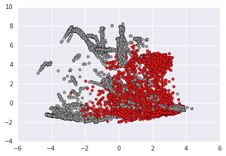
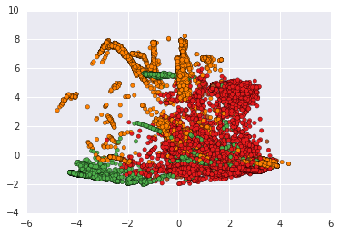

# Intrusion detection on NSL-KDD

This is my try with [NSL-KDD](http://www.unb.ca/research/iscx/dataset/iscx-NSL-KDD-dataset.html) dataset, which is an improved version of well-known [KDD'99](http://kdd.ics.uci.edu/databases/kddcup99/kddcup99.html) dataset. I've used Python, Scikit-learn and PySpark via [ready-to-run Jupyter applications in Docker](https://github.com/jupyter/docker-stacks).

I've tried a variety of approaches to deal with this dataset. Here are presented some of them.

To be able to run this notebook, use `make nsl-kdd-pyspark` command. It'll download the latest jupyter/pyspark-notebook docker image and start a container with Jupyter available at `8889` port.

## Contents

1. [Task description summary](#1-task-description-summary)
2. [Data loading](#2-data-loading)
3. [Exploratory Data Analysis](#3-exploratory-Data-Analysis)
4. [One Hot Encoding for categorical variables](#4-one-Hot-Encoding-for-categorical-variables)
5. [Feature Selection using Attribute Ratio](#5-feature-Selection-using-Attribute-Ratio)
6. [Data preparation](#6-data-preparation)
7. [Visualization via PCA](#7-visualization-via-PCA)
8. [KMeans clustering with Random Forest Classifiers](#8-kMeans-clustering-with-Random-Forest-Classifiers)
9. [Gaussian Mixture clustering with Random Forest Classifiers](#9-gaussian-Mixture-clustering-with-Random-Forest-Classifiers)
10. [Supervised approach for dettecting each type of attacks separately](#10-supervised-approach-for-dettecting-each-type-of-attacks-separately)
11. [Ensembling experiments](#11-ensembling-experiments)
12. [Results summary](#12-results-summary)

## 1. Task description summary

Software to detect network intrusions protects a computer network from unauthorized users, including perhaps insiders. The intrusion detector learning task is to build a predictive model (i.e. a classifier) capable of distinguishing between bad connections, called intrusions or attacks, and good normal connections.

A connection is a sequence of TCP packets starting and ending at some well defined times, between which data flows to and from a source IP address to a target IP address under some well defined protocol. Each connection is labeled as either normal, or as an attack, with exactly one specific attack type. Each connection record consists of about 100 bytes.

Attacks fall into four main categories:

- DOS: denial-of-service, e.g. syn flood;
- R2L: unauthorized access from a remote machine, e.g. guessing password;
- U2R: unauthorized access to local superuser (root) privileges, e.g., various ''buffer overflow'' attacks;
- probing: surveillance and other probing, e.g., port scanning.

It is important to note that the test data is not from the same probability distribution as the training data, and it includes specific attack types not in the training data. This makes the task more realistic. Some intrusion experts believe that most novel attacks are variants of known attacks and the "signature" of known attacks can be sufficient to catch novel variants.  The datasets contain a total of 24 training attack types, with an additional 14 types in the test data only.

The complete task description could be found [here](http://kdd.ics.uci.edu/databases/kddcup99/task.html).

### NSL-KDD dataset description

[NSL-KDD](http://www.unb.ca/research/iscx/dataset/iscx-NSL-KDD-dataset.html) is a data set suggested to solve some of the inherent problems of the [KDD'99](http://kdd.ics.uci.edu/databases/kddcup99/kddcup99.html) data set.

The NSL-KDD data set has the following advantages over the original KDD data set:
- It does not include redundant records in the train set, so the classifiers will not be biased towards more frequent records.
- There is no duplicate records in the proposed test sets; therefore, the performance of the learners are not biased by the methods which have better detection rates on the frequent records.
- The number of selected records from each difficultylevel group is inversely proportional to the percentage of records in the original KDD data set. As a result, the classification rates of distinct machine learning methods vary in a wider range, which makes it more efficient to have an accurate evaluation of different learning techniques.
- The number of records in the train and test sets are reasonable, which makes it affordable to run the experiments on the complete set without the need to randomly select a small portion. Consequently, evaluation results of different research works will be consistent and comparable.

## 2. Data loading


```python
# Here are some imports that are used along this notebook
import math
import itertools
import pandas
import numpy as np
import pandas as pd
import matplotlib.pyplot as plt
import seaborn as sns
from time import time
from collections import OrderedDict
%matplotlib inline
gt0 = time()
```


```python
import pyspark
from pyspark.sql import SQLContext, Row

# Creating local SparkContext with 8 threads and SQLContext based on it
sc = pyspark.SparkContext(master='local[8]')
sc.setLogLevel('INFO')
sqlContext = SQLContext(sc)
```


```python
from pyspark.sql.types import *
from pyspark.sql.functions import udf, split, col
import pyspark.sql.functions as sql

train20_nsl_kdd_dataset_path = "NSL_KDD_Dataset/KDDTrain+_20Percent.txt"
train_nsl_kdd_dataset_path = "NSL_KDD_Dataset/KDDTrain+.txt"
test_nsl_kdd_dataset_path = "NSL_KDD_Dataset/KDDTest+.txt"

col_names = np.array(["duration","protocol_type","service","flag","src_bytes",
    "dst_bytes","land","wrong_fragment","urgent","hot","num_failed_logins",
    "logged_in","num_compromised","root_shell","su_attempted","num_root",
    "num_file_creations","num_shells","num_access_files","num_outbound_cmds",
    "is_host_login","is_guest_login","count","srv_count","serror_rate",
    "srv_serror_rate","rerror_rate","srv_rerror_rate","same_srv_rate",
    "diff_srv_rate","srv_diff_host_rate","dst_host_count","dst_host_srv_count",
    "dst_host_same_srv_rate","dst_host_diff_srv_rate","dst_host_same_src_port_rate",
    "dst_host_srv_diff_host_rate","dst_host_serror_rate","dst_host_srv_serror_rate",
    "dst_host_rerror_rate","dst_host_srv_rerror_rate","labels"])

nominal_inx = [1, 2, 3]
binary_inx = [6, 11, 13, 14, 20, 21]
numeric_inx = list(set(range(41)).difference(nominal_inx).difference(binary_inx))

nominal_cols = col_names[nominal_inx].tolist()
binary_cols = col_names[binary_inx].tolist()
numeric_cols = col_names[numeric_inx].tolist()
```


```python
# Function to load dataset and divide it into 8 partitions
def load_dataset(path):
    dataset_rdd = sc.textFile(path, 8).map(lambda line: line.split(','))
    dataset_df = (dataset_rdd.toDF(col_names.tolist()).select(
                    col('duration').cast(DoubleType()),
                    col('protocol_type').cast(StringType()),
                    col('service').cast(StringType()),
                    col('flag').cast(StringType()),
                    col('src_bytes').cast(DoubleType()),
                    col('dst_bytes').cast(DoubleType()),
                    col('land').cast(DoubleType()),
                    col('wrong_fragment').cast(DoubleType()),
                    col('urgent').cast(DoubleType()),
                    col('hot').cast(DoubleType()),
                    col('num_failed_logins').cast(DoubleType()),
                    col('logged_in').cast(DoubleType()),
                    col('num_compromised').cast(DoubleType()),
                    col('root_shell').cast(DoubleType()),
                    col('su_attempted').cast(DoubleType()),
                    col('num_root').cast(DoubleType()),
                    col('num_file_creations').cast(DoubleType()),
                    col('num_shells').cast(DoubleType()),
                    col('num_access_files').cast(DoubleType()),
                    col('num_outbound_cmds').cast(DoubleType()),
                    col('is_host_login').cast(DoubleType()),
                    col('is_guest_login').cast(DoubleType()),
                    col('count').cast(DoubleType()),
                    col('srv_count').cast(DoubleType()),
                    col('serror_rate').cast(DoubleType()),
                    col('srv_serror_rate').cast(DoubleType()),
                    col('rerror_rate').cast(DoubleType()),
                    col('srv_rerror_rate').cast(DoubleType()),
                    col('same_srv_rate').cast(DoubleType()),
                    col('diff_srv_rate').cast(DoubleType()),
                    col('srv_diff_host_rate').cast(DoubleType()),
                    col('dst_host_count').cast(DoubleType()),
                    col('dst_host_srv_count').cast(DoubleType()),
                    col('dst_host_same_srv_rate').cast(DoubleType()),
                    col('dst_host_diff_srv_rate').cast(DoubleType()),
                    col('dst_host_same_src_port_rate').cast(DoubleType()),
                    col('dst_host_srv_diff_host_rate').cast(DoubleType()),
                    col('dst_host_serror_rate').cast(DoubleType()),
                    col('dst_host_srv_serror_rate').cast(DoubleType()),
                    col('dst_host_rerror_rate').cast(DoubleType()),
                    col('dst_host_srv_rerror_rate').cast(DoubleType()),
                    col('labels').cast(StringType())))

    return dataset_df
```

The first part of data preparation is deviding connections into normal and attack classes based on 'labels' column. Then attacks are splitted to four main categories: DoS, Probe, R2L and U2R. After this, all of those categories are indexed. Also, ID column is added to simplify work with clustered data.


```python
from pyspark.ml import Pipeline, Transformer
from pyspark.ml.feature import StringIndexer
from pyspark import keyword_only
from pyspark.ml.param.shared import HasInputCol, HasOutputCol, Param

# Dictionary that contains mapping of various attacks to the four main categories
attack_dict = {
    'normal': 'normal',
    
    'back': 'DoS',
    'land': 'DoS',
    'neptune': 'DoS',
    'pod': 'DoS',
    'smurf': 'DoS',
    'teardrop': 'DoS',
    'mailbomb': 'DoS',
    'apache2': 'DoS',
    'processtable': 'DoS',
    'udpstorm': 'DoS',
    
    'ipsweep': 'Probe',
    'nmap': 'Probe',
    'portsweep': 'Probe',
    'satan': 'Probe',
    'mscan': 'Probe',
    'saint': 'Probe',

    'ftp_write': 'R2L',
    'guess_passwd': 'R2L',
    'imap': 'R2L',
    'multihop': 'R2L',
    'phf': 'R2L',
    'spy': 'R2L',
    'warezclient': 'R2L',
    'warezmaster': 'R2L',
    'sendmail': 'R2L',
    'named': 'R2L',
    'snmpgetattack': 'R2L',
    'snmpguess': 'R2L',
    'xlock': 'R2L',
    'xsnoop': 'R2L',
    'worm': 'R2L',
    
    'buffer_overflow': 'U2R',
    'loadmodule': 'U2R',
    'perl': 'U2R',
    'rootkit': 'U2R',
    'httptunnel': 'U2R',
    'ps': 'U2R',    
    'sqlattack': 'U2R',
    'xterm': 'U2R'
}

attack_mapping_udf = udf(lambda v: attack_dict[v])

class Labels2Converter(Transformer):

    @keyword_only
    def __init__(self):
        super(Labels2Converter, self).__init__()

    def _transform(self, dataset):
        return dataset.withColumn('labels2', sql.regexp_replace(col('labels'), '^(?!normal).*$', 'attack'))
     
class Labels5Converter(Transformer):
    
    @keyword_only
    def __init__(self):
        super(Labels5Converter, self).__init__()

    def _transform(self, dataset):
        return dataset.withColumn('labels5', attack_mapping_udf(col('labels')))
    
labels2_indexer = StringIndexer(inputCol="labels2", outputCol="labels2_index")
labels5_indexer = StringIndexer(inputCol="labels5", outputCol="labels5_index")

labels_mapping_pipeline = Pipeline(stages=[Labels2Converter(), Labels5Converter(), labels2_indexer, labels5_indexer])

labels2 = ['normal', 'attack']
labels5 = ['normal', 'DoS', 'Probe', 'R2L', 'U2R']
labels_col = 'labels2_index'
```


```python
# Loading train data
t0 = time()
train_df = load_dataset(train_nsl_kdd_dataset_path)

# Fitting preparation pipeline
labels_mapping_model = labels_mapping_pipeline.fit(train_df)

# Transforming labels column and adding id column
train_df = labels_mapping_model.transform(train_df).withColumn('id', sql.monotonically_increasing_id())

train_df = train_df.cache()
print(train_df.count())
print(time() - t0)
```

    125973
    6.874044179916382


```python
# Loading test data
t0 = time()
test_df = load_dataset(test_nsl_kdd_dataset_path)

# Transforming labels column and adding id column
test_df = labels_mapping_model.transform(test_df).withColumn('id', sql.monotonically_increasing_id())

test_df = test_df.cache()
print(test_df.count())
print(time() - t0)
```

    22544
    0.778895378112793


## 2. Exploratory Data Analysis

Here are some descriptive statistics of available features.


```python
# Labels columns
(train_df.groupby('labels2').count().show())
(train_df.groupby('labels5').count().sort(sql.desc('count')).show())
```

    +-------+-----+
    |labels2|count|
    +-------+-----+
    | normal|67343|
    | attack|58630|
    +-------+-----+
    
    +-------+-----+
    |labels5|count|
    +-------+-----+
    | normal|67343|
    |    DoS|45927|
    |  Probe|11656|
    |    R2L|  995|
    |    U2R|   52|
    +-------+-----+
    


```python
(test_df.groupby('labels2').count().show())
(test_df.groupby('labels5').count().sort(sql.desc('count')).show())
```

    +-------+-----+
    |labels2|count|
    +-------+-----+
    | normal| 9711|
    | attack|12833|
    +-------+-----+
    
    +-------+-----+
    |labels5|count|
    +-------+-----+
    | normal| 9711|
    |    DoS| 7458|
    |    R2L| 2754|
    |  Probe| 2421|
    |    U2R|  200|
    +-------+-----+
    


```python
# 'protocol_type' nominal column
(train_df.crosstab(nominal_cols[0], 'labels2').sort(sql.asc(nominal_cols[0] + '_labels2')).show())
(train_df.crosstab(nominal_cols[0], 'labels5').sort(sql.asc(nominal_cols[0] + '_labels5')).show())
```

    +---------------------+------+------+
    |protocol_type_labels2|attack|normal|
    +---------------------+------+------+
    |                 icmp|  6982|  1309|
    |                  tcp| 49089| 53600|
    |                  udp|  2559| 12434|
    +---------------------+------+------+
    
    +---------------------+-----+-----+---+---+------+
    |protocol_type_labels5|  DoS|Probe|R2L|U2R|normal|
    +---------------------+-----+-----+---+---+------+
    |                 icmp| 2847| 4135|  0|  0|  1309|
    |                  tcp|42188| 5857|995| 49| 53600|
    |                  udp|  892| 1664|  0|  3| 12434|
    +---------------------+-----+-----+---+---+------+
    


```python
# 'service' nominal column
print(train_df.select(nominal_cols[1]).distinct().count())
(train_df.crosstab(nominal_cols[1], 'labels2').sort(sql.asc(nominal_cols[1] + '_labels2')).show(n=70))
(train_df.crosstab(nominal_cols[1], 'labels5').sort(sql.asc(nominal_cols[1] + '_labels5')).show(n=70))
```

    70
    +---------------+------+------+
    |service_labels2|attack|normal|
    +---------------+------+------+
    |            IRC|     1|   186|
    |            X11|     6|    67|
    |         Z39_50|   862|     0|
    |            aol|     2|     0|
    |           auth|   719|   236|
    |            bgp|   710|     0|
    |        courier|   734|     0|
    |       csnet_ns|   545|     0|
    |            ctf|   563|     0|
    |        daytime|   521|     0|
    |        discard|   538|     0|
    |         domain|   531|    38|
    |       domain_u|     9|  9034|
    |           echo|   434|     0|
    |          eco_i|  4089|   497|
    |          ecr_i|  2887|   190|
    |            efs|   485|     0|
    |           exec|   474|     0|
    |         finger|  1222|   545|
    |            ftp|   836|   918|
    |       ftp_data|  1876|  4984|
    |         gopher|   518|     0|
    |        harvest|     2|     0|
    |      hostnames|   460|     0|
    |           http|  2289| 38049|
    |      http_2784|     1|     0|
    |       http_443|   530|     0|
    |      http_8001|     2|     0|
    |          imap4|   644|     3|
    |       iso_tsap|   687|     0|
    |         klogin|   433|     0|
    |         kshell|   299|     0|
    |           ldap|   410|     0|
    |           link|   475|     0|
    |          login|   429|     0|
    |            mtp|   439|     0|
    |           name|   451|     0|
    |    netbios_dgm|   405|     0|
    |     netbios_ns|   347|     0|
    |    netbios_ssn|   362|     0|
    |        netstat|   360|     0|
    |           nnsp|   630|     0|
    |           nntp|   296|     0|
    |          ntp_u|     0|   168|
    |          other|  1755|  2604|
    |        pm_dump|     5|     0|
    |          pop_2|    78|     0|
    |          pop_3|    78|   186|
    |        printer|    69|     0|
    |        private| 20871|   982|
    |          red_i|     0|     8|
    |     remote_job|    78|     0|
    |            rje|    86|     0|
    |          shell|    61|     4|
    |           smtp|   284|  7029|
    |        sql_net|   245|     0|
    |            ssh|   306|     5|
    |         sunrpc|   381|     0|
    |         supdup|   544|     0|
    |         systat|   477|     0|
    |         telnet|  1436|   917|
    |         tftp_u|     0|     3|
    |          tim_i|     3|     5|
    |           time|   578|    76|
    |          urh_i|     0|    10|
    |          urp_i|     3|   599|
    |           uucp|   780|     0|
    |      uucp_path|   689|     0|
    |          vmnet|   617|     0|
    |          whois|   693|     0|
    +---------------+------+------+
    
    +---------------+-----+-----+---+---+------+
    |service_labels5|  DoS|Probe|R2L|U2R|normal|
    +---------------+-----+-----+---+---+------+
    |            IRC|    0|    1|  0|  0|   186|
    |            X11|    0|    6|  0|  0|    67|
    |         Z39_50|  851|   11|  0|  0|     0|
    |            aol|    0|    2|  0|  0|     0|
    |           auth|  703|   16|  0|  0|   236|
    |            bgp|  699|   11|  0|  0|     0|
    |        courier|  726|    8|  0|  0|     0|
    |       csnet_ns|  533|   12|  0|  0|     0|
    |            ctf|  538|   25|  0|  0|     0|
    |        daytime|  503|   18|  0|  0|     0|
    |        discard|  520|   18|  0|  0|     0|
    |         domain|  508|   23|  0|  0|    38|
    |       domain_u|    0|    9|  0|  0|  9034|
    |           echo|  416|   18|  0|  0|     0|
    |          eco_i|    0| 4089|  0|  0|   497|
    |          ecr_i| 2844|   43|  0|  0|   190|
    |            efs|  478|    7|  0|  0|     0|
    |           exec|  465|    9|  0|  0|     0|
    |         finger| 1168|   54|  0|  0|   545|
    |            ftp|  489|   32|312|  3|   918|
    |       ftp_data| 1209|   51|604| 12|  4984|
    |         gopher|  485|   33|  0|  0|     0|
    |        harvest|    0|    2|  0|  0|     0|
    |      hostnames|  447|   13|  0|  0|     0|
    |           http| 2255|   30|  4|  0| 38049|
    |      http_2784|    0|    1|  0|  0|     0|
    |       http_443|  523|    7|  0|  0|     0|
    |      http_8001|    0|    2|  0|  0|     0|
    |          imap4|  622|   11| 11|  0|     3|
    |       iso_tsap|  675|   12|  0|  0|     0|
    |         klogin|  425|    8|  0|  0|     0|
    |         kshell|  292|    7|  0|  0|     0|
    |           ldap|  403|    7|  0|  0|     0|
    |           link|  454|   21|  0|  0|     0|
    |          login|  420|    7|  2|  0|     0|
    |            mtp|  416|   23|  0|  0|     0|
    |           name|  428|   23|  0|  0|     0|
    |    netbios_dgm|  392|   13|  0|  0|     0|
    |     netbios_ns|  336|   11|  0|  0|     0|
    |    netbios_ssn|  349|   13|  0|  0|     0|
    |        netstat|  344|   16|  0|  0|     0|
    |           nnsp|  622|    8|  0|  0|     0|
    |           nntp|  281|   15|  0|  0|     0|
    |          ntp_u|    0|    0|  0|  0|   168|
    |          other|   58| 1689|  5|  3|  2604|
    |        pm_dump|    0|    5|  0|  0|     0|
    |          pop_2|   70|    8|  0|  0|     0|
    |          pop_3|   67|   11|  0|  0|   186|
    |        printer|   62|    7|  0|  0|     0|
    |        private|15971| 4900|  0|  0|   982|
    |          red_i|    0|    0|  0|  0|     8|
    |     remote_job|   60|   18|  0|  0|     0|
    |            rje|   68|   18|  0|  0|     0|
    |          shell|   53|    8|  0|  0|     4|
    |           smtp|  241|   43|  0|  0|  7029|
    |        sql_net|  233|   12|  0|  0|     0|
    |            ssh|  281|   25|  0|  0|     5|
    |         sunrpc|  369|   12|  0|  0|     0|
    |         supdup|  528|   16|  0|  0|     0|
    |         systat|  460|   17|  0|  0|     0|
    |         telnet| 1312|   33| 57| 34|   917|
    |         tftp_u|    0|    0|  0|  0|     3|
    |          tim_i|    3|    0|  0|  0|     5|
    |           time|  551|   27|  0|  0|    76|
    |          urh_i|    0|    0|  0|  0|    10|
    |          urp_i|    0|    3|  0|  0|   599|
    |           uucp|  769|   11|  0|  0|     0|
    |      uucp_path|  676|   13|  0|  0|     0|
    |          vmnet|  606|   11|  0|  0|     0|
    |          whois|  670|   23|  0|  0|     0|
    +---------------+-----+-----+---+---+------+
    


```python
# 'flag' nominal column
print(train_df.select(nominal_cols[2]).distinct().count())
(train_df.crosstab(nominal_cols[2], 'labels2').sort(sql.asc(nominal_cols[2] + '_labels2')).show())
(train_df.crosstab(nominal_cols[2], 'labels5').sort(sql.asc(nominal_cols[2] + '_labels5')).show())
```

    11
    +------------+------+------+
    |flag_labels2|attack|normal|
    +------------+------+------+
    |         OTH|    35|    11|
    |         REJ|  8540|  2693|
    |        RSTO|  1343|   219|
    |      RSTOS0|   103|     0|
    |        RSTR|  2275|   146|
    |          S0| 34497|   354|
    |          S1|     4|   361|
    |          S2|     8|   119|
    |          S3|     4|    45|
    |          SF| 11552| 63393|
    |          SH|   269|     2|
    +------------+------+------+
    
    +------------+-----+-----+---+---+------+
    |flag_labels5|  DoS|Probe|R2L|U2R|normal|
    +------------+-----+-----+---+---+------+
    |         OTH|    0|   35|  0|  0|    11|
    |         REJ| 5671| 2869|  0|  0|  2693|
    |        RSTO| 1216|   80| 46|  1|   219|
    |      RSTOS0|    0|  103|  0|  0|     0|
    |        RSTR|   90| 2180|  5|  0|   146|
    |          S0|34344|  153|  0|  0|   354|
    |          S1|    2|    1|  1|  0|   361|
    |          S2|    5|    2|  1|  0|   119|
    |          S3|    0|    1|  3|  0|    45|
    |          SF| 4599| 5967|935| 51| 63393|
    |          SH|    0|  265|  4|  0|     2|
    +------------+-----+-----+---+---+------+
    


```python
# Binary columns
(train_df.select(binary_cols).describe().toPandas().transpose())
```


<div>
<table border="1" class="dataframe">
  <thead>
    <tr style="text-align: right;">
      <th></th>
      <th>0</th>
      <th>1</th>
      <th>2</th>
      <th>3</th>
      <th>4</th>
    </tr>
  </thead>
  <tbody>
    <tr>
      <th>summary</th>
      <td>count</td>
      <td>mean</td>
      <td>stddev</td>
      <td>min</td>
      <td>max</td>
    </tr>
    <tr>
      <th>land</th>
      <td>125973</td>
      <td>1.9845522453224102E-4</td>
      <td>0.014086071671513094</td>
      <td>0.0</td>
      <td>1.0</td>
    </tr>
    <tr>
      <th>logged_in</th>
      <td>125973</td>
      <td>0.3957355941352512</td>
      <td>0.48901005300524175</td>
      <td>0.0</td>
      <td>1.0</td>
    </tr>
    <tr>
      <th>root_shell</th>
      <td>125973</td>
      <td>0.0013415573178379495</td>
      <td>0.03660284383979861</td>
      <td>0.0</td>
      <td>1.0</td>
    </tr>
    <tr>
      <th>su_attempted</th>
      <td>125973</td>
      <td>0.0011034110483992602</td>
      <td>0.04515438381386557</td>
      <td>0.0</td>
      <td>2.0</td>
    </tr>
    <tr>
      <th>is_host_login</th>
      <td>125973</td>
      <td>7.938208981289641E-6</td>
      <td>0.0028174827384191085</td>
      <td>0.0</td>
      <td>1.0</td>
    </tr>
    <tr>
      <th>is_guest_login</th>
      <td>125973</td>
      <td>0.009422654060790804</td>
      <td>0.09661232709143104</td>
      <td>0.0</td>
      <td>1.0</td>
    </tr>
  </tbody>
</table>
</div>


```python
# 'su_attempted' should be a binary feature, but has 3 values
(train_df.crosstab('su_attempted', 'labels2').show())
```

    +--------------------+------+------+
    |su_attempted_labels2|attack|normal|
    +--------------------+------+------+
    |                 2.0|     0|    59|
    |                 1.0|     1|    20|
    |                 0.0| 58629| 67264|
    +--------------------+------+------+
    


```python
# '2.0' value is replaced to '0.0' for both train and test datasets
train_df = train_df.replace(2.0, 0.0, 'su_attempted')
test_df = test_df.replace(2.0, 0.0, 'su_attempted')
```


```python
# Numeric columns
print(len(numeric_cols))
(train_df.select(numeric_cols).describe().toPandas().transpose())
```

    32


<div>
<table border="1" class="dataframe">
  <thead>
    <tr style="text-align: right;">
      <th></th>
      <th>0</th>
      <th>1</th>
      <th>2</th>
      <th>3</th>
      <th>4</th>
    </tr>
  </thead>
  <tbody>
    <tr>
      <th>summary</th>
      <td>count</td>
      <td>mean</td>
      <td>stddev</td>
      <td>min</td>
      <td>max</td>
    </tr>
    <tr>
      <th>duration</th>
      <td>125973</td>
      <td>287.1446500440571</td>
      <td>2604.515309867592</td>
      <td>0.0</td>
      <td>42908.0</td>
    </tr>
    <tr>
      <th>src_bytes</th>
      <td>125973</td>
      <td>45566.74300048423</td>
      <td>5870331.181893551</td>
      <td>0.0</td>
      <td>1.379963888E9</td>
    </tr>
    <tr>
      <th>dst_bytes</th>
      <td>125973</td>
      <td>19779.114421344257</td>
      <td>4021269.1514414474</td>
      <td>0.0</td>
      <td>1.309937401E9</td>
    </tr>
    <tr>
      <th>wrong_fragment</th>
      <td>125973</td>
      <td>0.022687401268525795</td>
      <td>0.25352998595201254</td>
      <td>0.0</td>
      <td>3.0</td>
    </tr>
    <tr>
      <th>urgent</th>
      <td>125973</td>
      <td>1.1113492573805498E-4</td>
      <td>0.014366026620154243</td>
      <td>0.0</td>
      <td>3.0</td>
    </tr>
    <tr>
      <th>hot</th>
      <td>125973</td>
      <td>0.20440888126820828</td>
      <td>2.1499684337047587</td>
      <td>0.0</td>
      <td>77.0</td>
    </tr>
    <tr>
      <th>num_failed_logins</th>
      <td>125973</td>
      <td>0.0012224841831186047</td>
      <td>0.045239138981329835</td>
      <td>0.0</td>
      <td>5.0</td>
    </tr>
    <tr>
      <th>num_compromised</th>
      <td>125973</td>
      <td>0.279250315543807</td>
      <td>23.942042242795125</td>
      <td>0.0</td>
      <td>7479.0</td>
    </tr>
    <tr>
      <th>num_root</th>
      <td>125973</td>
      <td>0.30219173949973405</td>
      <td>24.3996180888374</td>
      <td>0.0</td>
      <td>7468.0</td>
    </tr>
    <tr>
      <th>num_file_creations</th>
      <td>125973</td>
      <td>0.012669381534138267</td>
      <td>0.48393506939604286</td>
      <td>0.0</td>
      <td>43.0</td>
    </tr>
    <tr>
      <th>num_shells</th>
      <td>125973</td>
      <td>4.1278686702706137E-4</td>
      <td>0.02218112867869418</td>
      <td>0.0</td>
      <td>2.0</td>
    </tr>
    <tr>
      <th>num_access_files</th>
      <td>125973</td>
      <td>0.004096115834345455</td>
      <td>0.09936955575066156</td>
      <td>0.0</td>
      <td>9.0</td>
    </tr>
    <tr>
      <th>num_outbound_cmds</th>
      <td>125973</td>
      <td>0.0</td>
      <td>0.0</td>
      <td>0.0</td>
      <td>0.0</td>
    </tr>
    <tr>
      <th>count</th>
      <td>125973</td>
      <td>84.1075547934875</td>
      <td>114.50860735418405</td>
      <td>0.0</td>
      <td>511.0</td>
    </tr>
    <tr>
      <th>srv_count</th>
      <td>125973</td>
      <td>27.737888277646796</td>
      <td>72.6358396472384</td>
      <td>0.0</td>
      <td>511.0</td>
    </tr>
    <tr>
      <th>serror_rate</th>
      <td>125973</td>
      <td>0.2844845323997998</td>
      <td>0.4464556243310233</td>
      <td>0.0</td>
      <td>1.0</td>
    </tr>
    <tr>
      <th>srv_serror_rate</th>
      <td>125973</td>
      <td>0.2824853738499519</td>
      <td>0.44702249836401703</td>
      <td>0.0</td>
      <td>1.0</td>
    </tr>
    <tr>
      <th>rerror_rate</th>
      <td>125973</td>
      <td>0.11995848316702805</td>
      <td>0.3204355207495171</td>
      <td>0.0</td>
      <td>1.0</td>
    </tr>
    <tr>
      <th>srv_rerror_rate</th>
      <td>125973</td>
      <td>0.12118326943075099</td>
      <td>0.3236472280054629</td>
      <td>0.0</td>
      <td>1.0</td>
    </tr>
    <tr>
      <th>same_srv_rate</th>
      <td>125973</td>
      <td>0.660927659101567</td>
      <td>0.4396228624074799</td>
      <td>0.0</td>
      <td>1.0</td>
    </tr>
    <tr>
      <th>diff_srv_rate</th>
      <td>125973</td>
      <td>0.06305263826375185</td>
      <td>0.18031440750857483</td>
      <td>0.0</td>
      <td>1.0</td>
    </tr>
    <tr>
      <th>srv_diff_host_rate</th>
      <td>125973</td>
      <td>0.0973216482897124</td>
      <td>0.25983049812115877</td>
      <td>0.0</td>
      <td>1.0</td>
    </tr>
    <tr>
      <th>dst_host_count</th>
      <td>125973</td>
      <td>182.14894461511594</td>
      <td>99.20621303459785</td>
      <td>0.0</td>
      <td>255.0</td>
    </tr>
    <tr>
      <th>dst_host_srv_count</th>
      <td>125973</td>
      <td>115.65300500900987</td>
      <td>110.7027407808648</td>
      <td>0.0</td>
      <td>255.0</td>
    </tr>
    <tr>
      <th>dst_host_same_srv_rate</th>
      <td>125973</td>
      <td>0.521241694648872</td>
      <td>0.4489493637176792</td>
      <td>0.0</td>
      <td>1.0</td>
    </tr>
    <tr>
      <th>dst_host_diff_srv_rate</th>
      <td>125973</td>
      <td>0.08295110857087822</td>
      <td>0.18892179990461458</td>
      <td>0.0</td>
      <td>1.0</td>
    </tr>
    <tr>
      <th>dst_host_same_src_port_rate</th>
      <td>125973</td>
      <td>0.14837885896184153</td>
      <td>0.30899713037298737</td>
      <td>0.0</td>
      <td>1.0</td>
    </tr>
    <tr>
      <th>dst_host_srv_diff_host_rate</th>
      <td>125973</td>
      <td>0.03254244957252654</td>
      <td>0.11256380488118982</td>
      <td>0.0</td>
      <td>1.0</td>
    </tr>
    <tr>
      <th>dst_host_serror_rate</th>
      <td>125973</td>
      <td>0.2844524620355186</td>
      <td>0.44478405031648904</td>
      <td>0.0</td>
      <td>1.0</td>
    </tr>
    <tr>
      <th>dst_host_srv_serror_rate</th>
      <td>125973</td>
      <td>0.2784845165233854</td>
      <td>0.4456691238860301</td>
      <td>0.0</td>
      <td>1.0</td>
    </tr>
    <tr>
      <th>dst_host_rerror_rate</th>
      <td>125973</td>
      <td>0.11883181316631297</td>
      <td>0.3065574580251695</td>
      <td>0.0</td>
      <td>1.0</td>
    </tr>
    <tr>
      <th>dst_host_srv_rerror_rate</th>
      <td>125973</td>
      <td>0.12023989267541413</td>
      <td>0.3194593904552316</td>
      <td>0.0</td>
      <td>1.0</td>
    </tr>
  </tbody>
</table>
</div>


```python
(train_df.crosstab('num_outbound_cmds', 'labels2').show())
```

    +-------------------------+------+------+
    |num_outbound_cmds_labels2|attack|normal|
    +-------------------------+------+------+
    |                      0.0| 58630| 67343|
    +-------------------------+------+------+
    


As 'num_outbound_cmds' feature takes only 0.0 values, so it is dropped as redundant.


```python
train_df = train_df.drop('num_outbound_cmds')
test_df = test_df.drop('num_outbound_cmds')
numeric_cols.remove('num_outbound_cmds')
```

Commented code below is related to removing highly correlated features. However, it hasen't been tested a lot yet.


```python
# from pyspark.mllib.stat import Statistics
# from pyspark.mllib.linalg import Vectors
# from pyspark.ml.feature import VectorAssembler

# t0 = time()
# stat_assembler = VectorAssembler(
#                 inputCols=numeric_cols,
#                 outputCol='features')

# stat_rdd = stat_assembler.transform(train_df).rdd.map(lambda row: row['features'].toArray())

# pearson_corr = Statistics.corr(stat_rdd, method='pearson')
# spearman_corr = Statistics.corr(stat_rdd, method='spearman')

# print(time() - t0)
```


```python
# f, (ax1, ax2) = plt.subplots(1, 2, figsize=(18, 6))

# ax1.set_title("Pearson")
# ax2.set_title("Spearman")
# sns.heatmap(pearson_corr, ax=ax1)
# sns.heatmap(spearman_corr, ax=ax2)
```


```python
# inx_correlated_to_delete = [8, 15, 28, 17, 29]

# for inx in inx_correlated_to_delete:
#     train_df = train_df.drop(numeric_cols[inx])
#     test_df = test_df.drop(numeric_cols[inx])

# numeric_cols = [col for inx, col in enumerate(numeric_cols) if inx not in inx_correlated_to_delete]

# train_df = train_df.cache()
# test_df = test_df.cache()
# print(train_df.count())
# print(test_df.count())
# print(len(numeric_cols))
```

## 4. One Hot Encoding for categorical variables

One Hot Encoding (OHE) is used for treating categorical variables. Custom function is created for demonstration purposes. However, it could be easily replaced by PySpark OneHotEncoder.


```python
def ohe_vec(cat_dict, row):
    vec = np.zeros(len(cat_dict))
    vec[cat_dict[row]] = float(1.0)
    return vec.tolist()

def ohe(df, nominal_col):
    categories = (df.select(nominal_col)
                    .distinct()
                    .rdd.map(lambda row: row[0])
                    .collect())
    
    cat_dict = dict(zip(categories, range(len(categories))))
    
    udf_ohe_vec = udf(lambda row: ohe_vec(cat_dict, row), 
                      StructType([StructField(cat, DoubleType(), False) for cat in categories]))
    
    df = df.withColumn(nominal_col + '_ohe', udf_ohe_vec(col(nominal_col))).cache()
    
    nested_cols = [nominal_col + '_ohe.' + cat for cat in categories]
    ohe_cols = [nominal_col + '_' + cat for cat in categories]
        
    for new, old in zip(ohe_cols, nested_cols):
        df = df.withColumn(new, col(old))

    df = df.drop(nominal_col + '_ohe')
                   
    return df, ohe_cols
```


```python
t0 = time()
train_ohe_cols = []

train_df, train_ohe_col0 = ohe(train_df, nominal_cols[0])
train_ohe_cols += train_ohe_col0

train_df, train_ohe_col1 = ohe(train_df, nominal_cols[1])
train_ohe_cols += train_ohe_col1

train_df, train_ohe_col2 = ohe(train_df, nominal_cols[2])
train_ohe_cols += train_ohe_col2

binary_cols += train_ohe_cols

train_df = train_df.cache()
print(train_df.count())
print(time() - t0)
```

    125973
    13.566007614135742


Custom list of test binary cols is used as test dataset could contain additional categories for 'service' and 'flag' features. However, those additional categories aren't used below.


```python
t0 = time()
test_ohe_cols = []

test_df, test_ohe_col0_names = ohe(test_df, nominal_cols[0])
test_ohe_cols += test_ohe_col0_names

test_df, test_ohe_col1_names = ohe(test_df, nominal_cols[1])
test_ohe_cols += test_ohe_col1_names

test_df, test_ohe_col2_names = ohe(test_df, nominal_cols[2])
test_ohe_cols += test_ohe_col2_names

test_binary_cols = col_names[binary_inx].tolist() + test_ohe_cols

test_df = test_df.cache()
print(test_df.count())
print(time() - t0)
```

    22544
    9.082245588302612


## 5. Feature Selection using Attribute Ratio

Attribute Ratio approach is used for feature selection purposes. This approach was described by Hee-su Chae and Sang Hyun Choi in [Feature Selection for efficient Intrusion Detection using Attribute Ratio](http://www.naun.org/main/UPress/cc/2014/a102019-106.pdf) and [Feature Selection for Intrusion Detection using NSL-KDD](http://www.wseas.us/e-library/conferences/2013/Nanjing/ACCIS/ACCIS-30.pdf)

This approach is also used for nominal variables as they were encoded as binary variables above.

As it is a possible to have 'null' values because binary features could have Frequency(0) = 0, those 'null' values are replaced with 1000.0 (magic number). For NSL KDD dataset it is related only for 'protocol_type_tcp' ohe variable.


```python
def getAttributeRatio(df, numericCols, binaryCols, labelCol):
    ratio_dict = {}
    
    if numericCols:
        avg_dict = (df
                .select(list(map(lambda c: sql.avg(c).alias(c), numericCols)))
                .first()
                .asDict())

        ratio_dict.update(df
                .groupBy(labelCol)
                .avg(*numericCols)
                .select(list(map(lambda c: sql.max(col('avg(' + c + ')')/avg_dict[c]).alias(c), numericCols)))
                .fillna(0.0)
                .first()
                .asDict())
    
    if binaryCols:
        ratio_dict.update((df
                .groupBy(labelCol)
                .agg(*list(map(lambda c: (sql.sum(col(c))/(sql.count(col(c)) - sql.sum(col(c)))).alias(c), binaryCols)))
                .fillna(1000.0)
                .select(*list(map(lambda c: sql.max(col(c)).alias(c), binaryCols)))
                .first()
                .asDict()))
        
    return OrderedDict(sorted(ratio_dict.items(), key=lambda v: -v[1]))

def selectFeaturesByAR(ar_dict, min_ar):
    return [f for f in ar_dict.keys() if ar_dict[f] >= min_ar]
```


```python
t0 = time()
ar_dict = getAttributeRatio(train_df, numeric_cols, binary_cols, 'labels5')

print(len(ar_dict))
print(time() - t0)
ar_dict
```

    121
    4.625692367553711


    OrderedDict([('protocol_type_tcp', 1000.0),
                 ('num_shells', 326.11353550295854),
                 ('urgent', 173.03983516483518),
                 ('num_file_creations', 62.23362492770388),
                 ('flag_SF', 51.0),
                 ('num_failed_logins', 46.03855641845592),
                 ('hot', 40.77451681709518),
                 ('logged_in', 10.569767441860465),
                 ('dst_bytes', 9.154854355343401),
                 ('src_bytes', 8.464064204948945),
                 ('duration', 7.225829157212557),
                 ('dst_host_srv_diff_host_rate', 5.756880682756574),
                 ('dst_host_diff_srv_rate', 4.83734184897426),
                 ('num_access_files', 4.694879248658319),
                 ('dst_host_same_src_port_rate', 4.393080378884017),
                 ('num_compromised', 4.338539274983927),
                 ('diff_srv_rate', 4.069085485070395),
                 ('dst_host_srv_rerror_rate', 3.667920527965924),
                 ('srv_rerror_rate', 3.667741802325429),
                 ('rerror_rate', 3.645586087828447),
                 ('dst_host_rerror_rate', 3.2795669242444494),
                 ('srv_diff_host_rate', 3.0815657101103984),
                 ('flag_S0', 2.965034965034965),
                 ('wrong_fragment', 2.742896335488928),
                 ('dst_host_srv_serror_rate', 2.6731595957140732),
                 ('srv_serror_rate', 2.643246318490161),
                 ('serror_rate', 2.6310546426370265),
                 ('dst_host_serror_rate', 2.6293396511768043),
                 ('num_root', 2.6091432537726016),
                 ('count', 2.1174082949142403),
                 ('service_telnet', 1.8888888888888888),
                 ('dst_host_srv_count', 1.6453161847397422),
                 ('dst_host_same_srv_rate', 1.557578827974319),
                 ('service_ftp_data', 1.5447570332480818),
                 ('same_srv_rate', 1.5079612006047083),
                 ('dst_host_count', 1.3428596865228266),
                 ('service_http', 1.2988666621151088),
                 ('srv_count', 1.1773191099992069),
                 ('root_shell', 1.0),
                 ('service_private', 0.7252812314979278),
                 ('protocol_type_icmp', 0.5497939103842574),
                 ('service_eco_i', 0.5403726708074534),
                 ('is_guest_login', 0.45894428152492667),
                 ('service_ftp', 0.4568081991215227),
                 ('flag_REJ', 0.3265050642995334),
                 ('flag_RSTR', 0.23005487547488393),
                 ('protocol_type_udp', 0.22644739478045495),
                 ('service_other', 0.16945921541085582),
                 ('service_domain_u', 0.15493320070658045),
                 ('service_smtp', 0.11654010677454654),
                 ('service_ecr_i', 0.06601211614790056),
                 ('flag_RSTO', 0.04847207586933614),
                 ('service_finger', 0.026095310440358364),
                 ('flag_SH', 0.02326398033535247),
                 ('service_Z39_50', 0.018879226195758277),
                 ('service_uucp', 0.01702909783427078),
                 ('service_courier', 0.0160615915577089),
                 ('service_auth', 0.015544843445957898),
                 ('service_bgp', 0.0154550278588485),
                 ('service_uucp_path', 0.014938896377980597),
                 ('service_iso_tsap', 0.014916467780429593),
                 ('service_whois', 0.014804339660163068),
                 ('service_nnsp', 0.013729168965897804),
                 ('service_imap4', 0.013729168965897804),
                 ('service_vmnet', 0.013371284834844774),
                 ('service_time', 0.012142983074753174),
                 ('service_ctf', 0.011853092158893123),
                 ('service_csnet_ns', 0.011741639864299247),
                 ('service_supdup', 0.011630212119209674),
                 ('service_http_443', 0.011518808915514052),
                 ('service_discard', 0.011451978769793203),
                 ('service_domain', 0.011184746471740902),
                 ('service_daytime', 0.01107344135258894),
                 ('service_gopher', 0.010672945733022314),
                 ('service_efs', 0.010517283108539242),
                 ('service_exec', 0.010228322555100963),
                 ('service_systat', 0.010117227879561),
                 ('service_link', 0.009983946517713808),
                 ('service_hostnames', 0.00982849604221636),
                 ('service_name', 0.009406800149453835),
                 ('service_klogin', 0.009340248780273395),
                 ('service_login', 0.009229349330872173),
                 ('service_mtp', 0.009140647316033486),
                 ('service_echo', 0.009140647316033486),
                 ('service_urp_i', 0.0089745894762076),
                 ('flag_RSTOS0', 0.008915433220808448),
                 ('service_ldap', 0.008852473420613302),
                 ('service_netbios_dgm', 0.008608762490392005),
                 ('service_sunrpc', 0.00809956538917424),
                 ('service_netbios_ssn', 0.007657203036552723),
                 ('service_netstat', 0.0075466731018142726),
                 ('service_netbios_ns', 0.007369875633348687),
                 ('service_kshell', 0.006398597567656404),
                 ('service_ssh', 0.006156070630504316),
                 ('service_nntp', 0.006156070630504316),
                 ('flag_S1', 0.005389507628915231),
                 ('service_sql_net', 0.005099137742373178),
                 ('flag_S3', 0.0030241935483870967),
                 ('flag_OTH', 0.0030117890026675844),
                 ('service_pop_3', 0.0027696293759399615),
                 ('service_IRC', 0.0027696293759399615),
                 ('service_ntp_u', 0.0025009304056568663),
                 ('flag_S2', 0.0017702011186481019),
                 ('service_remote_job', 0.0015466575012888812),
                 ('service_rje', 0.0015466575012888812),
                 ('service_pop_2', 0.0015264845061822622),
                 ('service_printer', 0.0013517933064428214),
                 ('service_shell', 0.0011553385359898854),
                 ('su_attempted', 0.001006036217303823),
                 ('service_X11', 0.0009958974968785302),
                 ('service_pm_dump', 0.0004291477126426916),
                 ('land', 0.00039207998431680063),
                 ('service_aol', 0.00017161489617298782),
                 ('service_http_8001', 0.00017161489617298782),
                 ('service_harvest', 0.00017161489617298782),
                 ('service_urh_i', 0.0001485155867108253),
                 ('service_red_i', 0.00011880894037276305),
                 ('service_http_2784', 8.58000858000858e-05),
                 ('service_tim_i', 7.425227954498203e-05),
                 ('service_tftp_u', 4.455004455004455e-05),
                 ('is_host_login', 1.4849573817231445e-05)])


## 6. Data preparation

Standartization is necessary as a lot of distance based algorithms are used below. Custom standartization is created for demonstration purposes, so it could be easily replaced by PySpark StandardScaler. Note that data is sparse, so it is reasonable to not substract mean for avoiding violating sparsity. 


```python
t0 = time()
avg_dict = (train_df.select(list(map(lambda c: sql.avg(c).alias(c), numeric_cols))).first().asDict())
std_dict = (train_df.select(list(map(lambda c: sql.stddev(c).alias(c), numeric_cols))).first().asDict())

def standardizer(column):
    return ((col(column) - avg_dict[column])/std_dict[column]).alias(column)

# Standardizer without mean
# def standardizer(column):
#     return (col(column)/std_dict[column]).alias(column)

train_scaler = [*binary_cols, *list(map(standardizer, numeric_cols)), *['id', 'labels2_index', 'labels2', 'labels5_index', 'labels5']]
test_scaler = [*test_binary_cols, *list(map(standardizer, numeric_cols)), *['id', 'labels2_index', 'labels2', 'labels5_index', 'labels5']]

scaled_train_df = (train_df.select(train_scaler).cache())
scaled_test_df = (test_df.select(test_scaler).cache())

print(scaled_train_df.count())
print(scaled_test_df.count())
print(time() - t0)
```

    125973
    22544
    2.4975554943084717


VectorAssembler is used for combining a given list of columns into a single vector column. Then VectorIndexer is used for indexing categorical (binary) features. Indexing categorical features allows algorithms to treat them appropriately, improving performance.


```python
from pyspark.ml.feature import VectorIndexer, VectorAssembler
assembler = VectorAssembler(inputCols=selectFeaturesByAR(ar_dict, 0.01), outputCol='raw_features')
indexer = VectorIndexer(inputCol='raw_features', outputCol='indexed_features', maxCategories=2)

prep_pipeline = Pipeline(stages=[assembler, indexer])
prep_model = prep_pipeline.fit(scaled_train_df)
```


```python
t0 = time()
scaled_train_df = (prep_model
        .transform(scaled_train_df)
        .select('id', 'indexed_features', 'labels2_index', 'labels2', 'labels5_index', 'labels5')
        .cache())

scaled_test_df = (prep_model 
        .transform(scaled_test_df)
        .select('id', 'indexed_features','labels2_index', 'labels2', 'labels5_index', 'labels5')
        .cache())

print(scaled_train_df.count())
print(scaled_test_df.count())
print(time() - t0)
```

    125973
    22544
    1.659245252609253


```python
# Setting seed for reproducibility
seed = 4667979835606274383
print(seed)
```

    4667979835606274383


The train dataset is splitted into 80% train and 20% cross-validation sets.


```python
split = (scaled_train_df.randomSplit([0.8, 0.2], seed=seed))

scaled_train_df = split[0].cache()
scaled_cv_df = split[1].cache()

print(scaled_train_df.count())
print(scaled_cv_df.count())
```

    100840
    25133


Additional "result" dataframes are used to collect probabilities and predictions from different approaches.


```python
res_cv_df = scaled_cv_df.select(col('id'), col('labels2_index'), col('labels2'), col('labels5')).cache()
res_test_df = scaled_test_df.select(col('id'), col('labels2_index'), col('labels2'), col('labels5')).cache()
prob_cols = []
pred_cols = []

print(res_cv_df.count())
print(res_test_df.count())
```

    25133
    22544


Different metrics from sklearn are used for evaluating results. The most important from them for this task are False positive Rate, Detection Rate and F1 score. 
As evaluating via sklearn requires to collect predicted and label columns to the driver, it will be replaced with PySpark metrics later.


```python
import sklearn.metrics as metrics

def printCM(cm, labels):
    """pretty print for confusion matrixes"""
    columnwidth = max([len(x) for x in labels])
    # Print header
    print(" " * columnwidth, end="\t")
    for label in labels:
        print("%{0}s".format(columnwidth) % label, end="\t")
    print()
    # Print rows
    for i, label1 in enumerate(labels):
        print("%{0}s".format(columnwidth) % label1, end="\t")
        for j in range(len(labels)):
            print("%{0}d".format(columnwidth) % cm[i, j], end="\t")
        print()

def getPrediction(e):
    return udf(lambda row: 1.0 if row >= e else 0.0, DoubleType())
        
def printReport(resDF, probCol, labelCol='labels2_index', e=None, labels=['normal', 'attack']):
    if (e):
        predictionAndLabels = list(zip(*resDF.rdd
                                       .map(lambda row: (1.0 if row[probCol] >= e else 0.0, row[labelCol]))
                                       .collect()))
    else:
        predictionAndLabels = list(zip(*resDF.rdd
                                       .map(lambda row: (row[probCol], row[labelCol]))
                                       .collect()))
    
    cm = metrics.confusion_matrix(predictionAndLabels[1], predictionAndLabels[0])
    printCM(cm, labels)
    print(" ")
    print("Accuracy = %g" % (metrics.accuracy_score(predictionAndLabels[1], predictionAndLabels[0])))
    print("AUC = %g" % (metrics.roc_auc_score(predictionAndLabels[1], predictionAndLabels[0])))
    print(" ")
    print("False Alarm Rate = %g" % (cm[0][1]/(cm[0][0] + cm[0][1])))
    print("Detection Rate = %g" % (cm[1][1]/(cm[1][1] + cm[1][0])))
    print("F1 score = %g" % (metrics.f1_score(predictionAndLabels[1], predictionAndLabels[0], labels)))
    print(" ")
    print(metrics.classification_report(predictionAndLabels[1], predictionAndLabels[0]))
    print(" ")
```

## 7. Visualization via PCA

PCA algorithm is used for visualization purposes. It's also used later as preprocessing for Gaussian Mixture clustering.

First graph shows 'attack' vs 'normal' labels, second graph shows 4 different types of attacks vs normal connections.


```python
from pyspark.ml.feature import VectorSlicer
from pyspark.ml.feature import PCA

t0 = time()
pca_slicer = VectorSlicer(inputCol="indexed_features", outputCol="features", names=selectFeaturesByAR(ar_dict, 0.05))

pca = PCA(k=2, inputCol="features", outputCol="pca_features")
pca_pipeline = Pipeline(stages=[pca_slicer, pca])

pca_train_df = pca_pipeline.fit(scaled_train_df).transform(scaled_train_df)
print(time() - t0)
```

    1.282867193222046


```python
t0 = time()
viz_train_data = np.array(pca_train_df.rdd.map(lambda row: [*row['pca_features'], row['labels2_index'], row['labels5_index']]).collect())
plt.figure()
plt.scatter(x=viz_train_data[:,0], y=viz_train_data[:,1], c=viz_train_data[:,2], cmap="Set1")
plt.figure()
plt.scatter(x=viz_train_data[:,0], y=viz_train_data[:,1], c=viz_train_data[:,3], cmap="Set1")
plt.show()
print(time() - t0)
```








    12.06510329246521


## 8. KMeans clustering with Random Forest Classifiers

The idea of the first approach is to clusterize data into clusters and then train different Random Forest classifiers for each of the clusters. As Random Forest returns probabilities, it is possible to improve detection rate for a new types of attacks by adjusting threshold.

As KMeans cannot truly handle binary/categorical features only numeric features are used for clustarization.


```python
kmeans_prob_col = 'kmeans_rf_prob'
kmeans_pred_col = 'kmeans_rf_pred'

prob_cols.append(kmeans_prob_col)
pred_cols.append(kmeans_pred_col)
```


```python
# KMeans clustrering
from pyspark.ml.clustering import KMeans

t0 = time()
kmeans_slicer = VectorSlicer(inputCol="indexed_features", outputCol="features", 
                             names=list(set(selectFeaturesByAR(ar_dict, 0.1)).intersection(numeric_cols)))

kmeans = KMeans(k=8, initSteps=25, maxIter=100, featuresCol="features", predictionCol="cluster", seed=seed)

kmeans_pipeline = Pipeline(stages=[kmeans_slicer, kmeans])

kmeans_model = kmeans_pipeline.fit(scaled_train_df)

kmeans_train_df = kmeans_model.transform(scaled_train_df).cache()
kmeans_cv_df = kmeans_model.transform(scaled_cv_df).cache()
kmeans_test_df = kmeans_model.transform(scaled_test_df).cache()

print(time() - t0)
```

    11.780123472213745


```python
# Function for describing the contents of the clusters 
def getClusterCrosstab(df, clusterCol='cluster'):
    return (df.crosstab(clusterCol, 'labels2')
              .withColumn('count', col('attack') + col('normal'))
              .withColumn(clusterCol + '_labels2', col(clusterCol + '_labels2').cast('int'))
              .sort(col(clusterCol +'_labels2').asc()))
```


```python
kmeans_crosstab = getClusterCrosstab(kmeans_train_df).cache()
kmeans_crosstab.show(n=30)
```

    +---------------+------+------+-----+
    |cluster_labels2|attack|normal|count|
    +---------------+------+------+-----+
    |              0|  6659| 46448|53107|
    |              1|  9125|  2266|11391|
    |              2|   626|    61|  687|
    |              3| 27742|   101|27843|
    |              4|  2670|  5073| 7743|
    |              5|     1|     0|    1|
    |              6|     0|    24|   24|
    |              7|     2|    42|   44|
    +---------------+------+------+-----+
    


Clustres are splitted into two categories. Frist category contains clusters that have both 'attack' and 'normal' connections and have more than 25 connections. For the first category Random Forest classifiers are aplied. Second category contains all other clusters and maps cluster to 'attack' or 'normal' based on majority. All clusters that contains less or equal than 25 connections are treated as outliers and are mapped to 'attack' type.


```python
# Function for splitting clusters
def splitClusters(crosstab):
    exp = ((col('count') > 25) & (col('attack') > 0) & (col('normal') > 0))

    cluster_rf = (crosstab
        .filter(exp).rdd
        .map(lambda row: (int(row['cluster_labels2']), [row['count'], row['attack']/row['count']]))
        .collectAsMap())

    cluster_mapping = (crosstab
        .filter(~exp).rdd
        .map(lambda row: (int(row['cluster_labels2']), 1.0 if (row['count'] <= 25) | (row['normal'] == 0) else 0.0))
        .collectAsMap())
    
    return cluster_rf, cluster_mapping

kmeans_cluster_rf, kmeans_cluster_mapping = splitClusters(kmeans_crosstab)

print(len(kmeans_cluster_rf), len(kmeans_cluster_mapping))
print(kmeans_cluster_mapping)
kmeans_cluster_rf
```

    6 2
    {5: 1.0, 6: 1.0}


    {0: [53107, 0.1253883668819553],
     1: [11391, 0.8010710209814766],
     2: [687, 0.9112081513828238],
     3: [27843, 0.9963725173293108],
     4: [7743, 0.3448275862068966],
     7: [44, 0.045454545454545456]}


```python
from pyspark.ml.classification import RandomForestClassifier

# This function returns Random Forest models for provided clusters
def getClusterModels(df, cluster_rf):
    cluster_models = {}

    labels_col = 'labels2_cl_index'
    labels2_indexer.setOutputCol(labels_col)

    rf_slicer = VectorSlicer(inputCol="indexed_features", outputCol="rf_features", 
                             names=selectFeaturesByAR(ar_dict, 0.05))

    for cluster in cluster_rf.keys():
        t1 = time()
        rf_classifier = RandomForestClassifier(labelCol=labels_col, featuresCol='rf_features', seed=seed,
                                               numTrees=500, maxDepth=20, featureSubsetStrategy="sqrt")
        
        rf_pipeline = Pipeline(stages=[labels2_indexer, rf_slicer, rf_classifier])
        cluster_models[cluster] = rf_pipeline.fit(df.filter(col('cluster') == cluster))
        print("Finished %g cluster in %g ms" % (cluster, time() - t1))
        
    return cluster_models
```


```python
# This utility function helps to get predictions/probabilities for the new data and return them into one dataframe
def getProbabilities(df, probCol, cluster_mapping, cluster_models):
    pred_df = (sqlContext.createDataFrame([], StructType([
                    StructField('id', LongType(), False),
                    StructField(probCol, DoubleType(), False)])))
    
    udf_map = udf(lambda cluster: cluster_mapping[cluster], DoubleType())
    pred_df = pred_df.union(df.filter(col('cluster').isin(list(cluster_mapping.keys())))
                            .withColumn(probCol, udf_map(col('cluster')))
                            .select('id', probCol))

                                       
    for k in cluster_models.keys():
        maj_label = cluster_models[k].stages[0].labels[0]
        udf_remap_prob = udf(lambda row: float(row[0]) if (maj_label == 'attack') else float(row[1]), DoubleType())

        pred_df = pred_df.union(cluster_models[k]
                         .transform(df.filter(col('cluster') == k))
                         .withColumn(probCol, udf_remap_prob(col('probability')))
                         .select('id', probCol))

    return pred_df
```


```python
# Training Random Forest classifiers for each of the clusters
t0 = time()
kmeans_cluster_models = getClusterModels(kmeans_train_df, kmeans_cluster_rf)
print(time() - t0)
```

    Finished 0 cluster in 197.395 ms
    Finished 1 cluster in 18.5909 ms
    Finished 2 cluster in 1.40909 ms
    Finished 3 cluster in 12.9506 ms
    Finished 4 cluster in 3.07712 ms
    Finished 7 cluster in 0.999874 ms
    234.42527198791504


```python
# Getting probabilities for CV data
t0 = time()
res_cv_df = (res_cv_df.drop(kmeans_prob_col)
             .join(getProbabilities(kmeans_cv_df, kmeans_prob_col, kmeans_cluster_mapping, kmeans_cluster_models), 'id')
             .cache())

print(res_cv_df.count())
print(time() - t0)
```

    25133
    17.96238350868225


```python
# Getting probabilities for Test data
t0 = time()
res_test_df = (res_test_df.drop(kmeans_prob_col)
               .join(getProbabilities(kmeans_test_df, kmeans_prob_col, kmeans_cluster_mapping, kmeans_cluster_models), 'id')
               .cache())

print(res_test_df.count())
print(time() - t0)
```

    22544
    16.670548915863037


As CV data is from the same distribution as the train data it isn't needed to adjust threshold.


```python
printReport(res_cv_df, kmeans_prob_col, e=0.5, labels=labels2)
```

          	normal	attack	
    normal	 13316	    12	
    attack	    26	 11779	
     
    Accuracy = 0.998488
    AUC = 0.998449
     
    False Alarm Rate = 0.00090036
    Detection Rate = 0.997798
    F1 score = 0.99839
     
                 precision    recall  f1-score   support
    
            0.0       1.00      1.00      1.00     13328
            1.0       1.00      1.00      1.00     11805
    
    avg / total       1.00      1.00      1.00     25133
    
     


Because test data is from the different distribution and it is expected to face unseen attack types, it makes sence to adjust a probability threshold to something like 0.01 for attack connections (0.99 for normal connections). For this approach it gives around ~98-99% Detection Rate with around ~14-15% of False Alarm Rate.


```python
printReport(res_test_df, kmeans_prob_col, e=0.01, labels=labels2)
```

          	normal	attack	
    normal	  8262	  1449	
    attack	   182	 12651	
     
    Accuracy = 0.927653
    AUC = 0.918303
     
    False Alarm Rate = 0.149212
    Detection Rate = 0.985818
    F1 score = 0.939442
     
                 precision    recall  f1-score   support
    
            0.0       0.98      0.85      0.91      9711
            1.0       0.90      0.99      0.94     12833
    
    avg / total       0.93      0.93      0.93     22544
    
     


```python
# Adding prediction columns based on chosen thresholds into result dataframes
t0 = time()
res_cv_df = res_cv_df.withColumn(kmeans_pred_col, getPrediction(0.5)(col(kmeans_prob_col))).cache()
res_test_df = res_test_df.withColumn(kmeans_pred_col, getPrediction(0.01)(col(kmeans_prob_col))).cache()

print(res_cv_df.count())
print(res_test_df.count())
print(time() - t0)
```

    25133
    22544
    16.63809633255005


## 9. Gaussian Mixture clustering with Random Forest Classifiers

The idea of this approach is to clusterize data into clusters via Gaussian Mixture and then train different Random Forest classifiers for each of the clusters. Gaussian Mixture produces a diffirent clustering than KMeans, so results from both approaches could be combine for improving performance. As Gaussian Mixture clustering doesn't work well on high-demensional data PCA algorithm is used for preprocessing.


```python
gm_prob_col = 'gm_rf_prob'
gm_pred_col = 'gm_rf_pred'

prob_cols.append(gm_prob_col)
pred_cols.append(gm_pred_col)
```


```python
# Gaussian Mixture clustering
from pyspark.ml.clustering import GaussianMixture

t0 = time()
gm = GaussianMixture(k=8, maxIter=150, seed=seed, featuresCol="pca_features", 
                     predictionCol="cluster", probabilityCol="gm_prob")

gm_pipeline = Pipeline(stages=[pca_slicer, pca, gm])
gm_model = gm_pipeline.fit(scaled_train_df)

gm_train_df = gm_model.transform(scaled_train_df).cache()
gm_cv_df = gm_model.transform(scaled_cv_df).cache()
gm_test_df = gm_model.transform(scaled_test_df).cache()

gm_params = (gm_model.stages[2].gaussiansDF.rdd
                  .map(lambda row: [row['mean'].toArray(), row['cov'].toArray()])
                  .collect())
gm_weights = gm_model.stages[2].weights

print(gm_train_df.count())
print(gm_cv_df.count())
print(gm_test_df.count())
print(time() - t0)
```

    100840
    25133
    22544
    12.079548120498657


```python
# Description of the contents of the clusters 
gm_crosstab = getClusterCrosstab(gm_train_df).cache()
gm_crosstab.show(n=30)
```

    +---------------+------+------+-----+
    |cluster_labels2|attack|normal|count|
    +---------------+------+------+-----+
    |              0| 22895|     0|22895|
    |              1|  7548| 19846|27394|
    |              2|    30| 26900|26930|
    |              3|  4024|     0| 4024|
    |              4|  4154|  2212| 6366|
    |              5|  1136|  1007| 2143|
    |              6|  5479|     0| 5479|
    |              7|  1559|  4050| 5609|
    +---------------+------+------+-----+
    


```python
# Splitting clusters
gm_cluster_rf, gm_cluster_mapping = splitClusters(gm_crosstab)

print(len(gm_cluster_rf), len(gm_cluster_mapping))
print(gm_cluster_mapping)
gm_cluster_rf
```

    5 3
    {0: 1.0, 3: 1.0, 6: 1.0}


    {1: [27394, 0.27553478863984815],
     2: [26930, 0.0011139992573338284],
     4: [6366, 0.6525290606346215],
     5: [2143, 0.5300979934671022],
     7: [5609, 0.27794615796042077]}


```python
# Training Random Forest classifiers for each of the clusters
t0 = time()
gm_cluster_models = getClusterModels(gm_train_df, gm_cluster_rf)
print(time() - t0)
```

    Finished 1 cluster in 89.9797 ms
    Finished 2 cluster in 5.05247 ms
    Finished 4 cluster in 12.6685 ms
    Finished 5 cluster in 12.9819 ms
    Finished 7 cluster in 24.1031 ms
    144.7893054485321


```python
# Getting probabilities for CV data
t0 = time()
res_cv_df = (res_cv_df.drop(gm_prob_col)
             .join(getProbabilities(gm_cv_df, gm_prob_col, gm_cluster_mapping, gm_cluster_models), 'id')
             .cache())

print(res_cv_df.count())
print(time() - t0)
```

    25133
    22.402843713760376


```python
# Getting probabilities for Test data
t0 = time()
res_test_df = (res_test_df.drop(gm_prob_col)
               .join(getProbabilities(gm_test_df, gm_prob_col, gm_cluster_mapping, gm_cluster_models), 'id')
               .cache())

print(res_test_df.count())
print(time() - t0)
```

    22544
    23.39514684677124


```python
printReport(res_cv_df, gm_prob_col, e=0.5, labels=labels2)
```

          	normal	attack	
    normal	 13322	     6	
    attack	    36	 11769	
     
    Accuracy = 0.998329
    AUC = 0.99825
     
    False Alarm Rate = 0.00045018
    Detection Rate = 0.99695
    F1 score = 0.998219
     
                 precision    recall  f1-score   support
    
            0.0       1.00      1.00      1.00     13328
            1.0       1.00      1.00      1.00     11805
    
    avg / total       1.00      1.00      1.00     25133
    
     


```python
printReport(res_test_df, gm_prob_col, e=0.01, labels=labels2)
```

          	normal	attack	
    normal	  8340	  1371	
    attack	   727	 12106	
     
    Accuracy = 0.906938
    AUC = 0.901085
     
    False Alarm Rate = 0.14118
    Detection Rate = 0.943349
    F1 score = 0.920258
     
                 precision    recall  f1-score   support
    
            0.0       0.92      0.86      0.89      9711
            1.0       0.90      0.94      0.92     12833
    
    avg / total       0.91      0.91      0.91     22544
    
     


```python
# Adding prediction columns based on chosen thresholds into result dataframes
t0 = time()
res_cv_df = res_cv_df.withColumn(gm_pred_col, getPrediction(0.5)(col(gm_prob_col))).cache()
res_test_df = res_test_df.withColumn(gm_pred_col, getPrediction(0.01)(col(gm_prob_col))).cache()

print(res_cv_df.count())
print(res_test_df.count())
print(time() - t0)
```

    25133
    22544
    17.49277424812317


## 10. Supervised approach for dettecting each type of attacks separately

The idea of the following approach is training Random Forest Classifiers for each of four major 'attack' categories separately.

### 10.1 DoS and normal


```python
dos_prob_col = 'dos_prob'
dos_pred_col = 'dos_pred'

prob_cols.append(dos_prob_col)
pred_cols.append(dos_pred_col)
```


```python
dos_exp = (col('labels5') == 'DoS') | (col('labels5') == 'normal')
dos_train_df = (scaled_train_df.filter(dos_exp).cache())

print(dos_train_df.count())
(dos_train_df
     .groupby('labels5')
     .count()
     .sort(sql.desc('count'))
     .show())
```

    90750
    +-------+-----+
    |labels5|count|
    +-------+-----+
    | normal|54015|
    |    DoS|36735|
    +-------+-----+
    


Commented code below is related to undersampling 'normal' connections. It could give better results. However, it hasen't been tested a lot yet.


```python
# dos_train_df = dos_train_df.sampleBy('labels5', fractions={'normal': 45927./67343, 'DoS': 1.0}).cache()

# print(dos_train_df.count())
# (dos_train_df
#      .groupby('labels5')
#      .count()
#      .sort(sql.desc('count'))
#      .show())
```

Diffirent AR feature selection is used as only normal and DoS connections are treated. Note that train dataframe without standartization is used for getting Attribute Ratio dictionary.


```python
t0 = time()
dos_ar_dict = getAttributeRatio(train_df.filter(dos_exp), numeric_cols, binary_cols, 'labels5')

print(time() - t0)
dos_ar_dict
```

    4.590113162994385


    OrderedDict([('flag_SF', 16.04886075949367),
                 ('protocol_type_tcp', 11.283230810377106),
                 ('flag_S0', 2.965034965034965),
                 ('wrong_fragment', 2.4663052235068696),
                 ('logged_in', 2.4559683875603),
                 ('dst_host_srv_serror_rate', 2.4369460592636014),
                 ('srv_serror_rate', 2.4091388710886883),
                 ('serror_rate', 2.403031496724026),
                 ('dst_host_serror_rate', 2.400741230991577),
                 ('count', 2.0805650842389314),
                 ('rerror_rate', 1.729470874459902),
                 ('srv_rerror_rate', 1.7274542811973763),
                 ('dst_host_srv_rerror_rate', 1.7208022988464688),
                 ('dst_host_rerror_rate', 1.7204184332241286),
                 ('num_failed_logins', 1.6819862494988345),
                 ('num_root', 1.6819862494988345),
                 ('num_access_files', 1.6819862494988342),
                 ('num_shells', 1.6819862494988342),
                 ('num_file_creations', 1.6819862494988342),
                 ('urgent', 1.6819862494988342),
                 ('duration', 1.6819438793516928),
                 ('num_compromised', 1.639589690499449),
                 ('dst_bytes', 1.6383223072580753),
                 ('srv_diff_host_rate', 1.635027252294015),
                 ('dst_host_srv_diff_host_rate', 1.6123221582570733),
                 ('src_bytes', 1.585158247265785),
                 ('dst_host_srv_count', 1.5359730763294566),
                 ('dst_host_same_srv_rate', 1.523983808504667),
                 ('hot', 1.5045374266320413),
                 ('diff_srv_rate', 1.4988971605166357),
                 ('same_srv_rate', 1.4819253849686713),
                 ('dst_host_same_src_port_rate', 1.3168437158004334),
                 ('dst_host_count', 1.30921165492205),
                 ('dst_host_diff_srv_rate', 1.3068775153420957),
                 ('service_http', 1.2988666621151088),
                 ('srv_count', 1.0994997402557993),
                 ('service_private', 0.5331486179730272),
                 ('protocol_type_udp', 0.22644739478045495),
                 ('service_domain_u', 0.15493320070658045),
                 ('flag_REJ', 0.14087341017488075),
                 ('service_smtp', 0.11654010677454654),
                 ('service_ftp_data', 0.07992430924164916),
                 ('protocol_type_icmp', 0.06608635097493036),
                 ('service_ecr_i', 0.06601211614790056),
                 ('service_other', 0.04022304947558659),
                 ('service_telnet', 0.02940715006163846),
                 ('flag_RSTO', 0.02719688667218358),
                 ('service_finger', 0.026095310440358364),
                 ('service_Z39_50', 0.018879226195758277),
                 ('service_uucp', 0.01702909783427078),
                 ('service_courier', 0.0160615915577089),
                 ('service_auth', 0.015544843445957898),
                 ('service_bgp', 0.0154550278588485),
                 ('service_uucp_path', 0.014938896377980597),
                 ('service_iso_tsap', 0.014916467780429593),
                 ('service_whois', 0.014804339660163068),
                 ('service_ftp', 0.013820097854723372),
                 ('service_nnsp', 0.013729168965897804),
                 ('service_imap4', 0.013729168965897804),
                 ('service_vmnet', 0.013371284834844774),
                 ('is_guest_login', 0.013133744546411915),
                 ('service_time', 0.012142983074753174),
                 ('service_ctf', 0.011853092158893123),
                 ('service_csnet_ns', 0.011741639864299247),
                 ('service_supdup', 0.011630212119209674),
                 ('service_http_443', 0.011518808915514052),
                 ('service_discard', 0.011451978769793203),
                 ('service_domain', 0.011184746471740902),
                 ('service_daytime', 0.01107344135258894),
                 ('service_gopher', 0.010672945733022314),
                 ('service_efs', 0.010517283108539242),
                 ('service_exec', 0.010228322555100963),
                 ('service_systat', 0.010117227879561),
                 ('service_link', 0.009983946517713808),
                 ('service_hostnames', 0.00982849604221636),
                 ('service_name', 0.009406800149453835),
                 ('service_klogin', 0.009340248780273395),
                 ('service_login', 0.009229349330872173),
                 ('service_mtp', 0.009140647316033486),
                 ('service_echo', 0.009140647316033486),
                 ('service_urp_i', 0.0089745894762076),
                 ('service_ldap', 0.008852473420613302),
                 ('service_netbios_dgm', 0.008608762490392005),
                 ('service_sunrpc', 0.00809956538917424),
                 ('service_netbios_ssn', 0.007657203036552723),
                 ('service_netstat', 0.0075466731018142726),
                 ('service_eco_i', 0.007434999850402417),
                 ('service_netbios_ns', 0.007369875633348687),
                 ('service_kshell', 0.006398597567656404),
                 ('service_ssh', 0.006156070630504316),
                 ('service_nntp', 0.006156070630504316),
                 ('flag_S1', 0.005389507628915231),
                 ('service_sql_net', 0.005099137742373178),
                 ('service_pop_3', 0.0027696293759399615),
                 ('service_IRC', 0.0027696293759399615),
                 ('service_ntp_u', 0.0025009304056568663),
                 ('flag_RSTR', 0.002172716043871006),
                 ('root_shell', 0.0020385084665059667),
                 ('flag_S2', 0.0017702011186481019),
                 ('service_pop_2', 0.0015264845061822622),
                 ('service_rje', 0.0014828059922806865),
                 ('service_printer', 0.0013517933064428214),
                 ('service_remote_job', 0.0013081300281247957),
                 ('service_shell', 0.0011553385359898854),
                 ('service_X11', 0.0009958974968785302),
                 ('flag_S3', 0.0006686677167226366),
                 ('land', 0.00039207998431680063),
                 ('su_attempted', 0.00029707529373319667),
                 ('flag_OTH', 0.00016336957167468663),
                 ('service_urh_i', 0.0001485155867108253),
                 ('service_red_i', 0.00011880894037276305),
                 ('service_tim_i', 7.425227954498203e-05),
                 ('service_tftp_u', 4.455004455004455e-05),
                 ('flag_SH', 2.969958866069705e-05),
                 ('is_host_login', 1.4849573817231445e-05),
                 ('service_aol', 0.0),
                 ('flag_RSTOS0', 0.0),
                 ('service_pm_dump', 0.0),
                 ('service_http_8001', 0.0),
                 ('service_harvest', 0.0),
                 ('service_http_2784', 0.0)])


```python
t0 = time()
dos_slicer = VectorSlicer(inputCol="indexed_features", outputCol="features", 
                          names=selectFeaturesByAR(dos_ar_dict, 0.05))

dos_rf = RandomForestClassifier(labelCol=labels_col, featuresCol='features', featureSubsetStrategy='sqrt',
                                numTrees=500, maxDepth=20, seed=seed)

dos_rf_pipeline = Pipeline(stages=[dos_slicer, dos_rf])
dos_rf_model = dos_rf_pipeline.fit(dos_train_df)

dos_cv_df = dos_rf_model.transform(scaled_cv_df).cache()
dos_test_df = dos_rf_model.transform(scaled_test_df).cache()
print(dos_cv_df.count())
print(dos_test_df.count())

print(time() - t0)
```

    25133
    22544
    154.9416139125824


```python
# Getting probabilities for CV data
t0 = time()
res_cv_df = (res_cv_df.drop(dos_prob_col)
             .join(dos_cv_df.rdd
                    .map(lambda row: (row['id'], float(row['probability'][1])))
                    .toDF(['id', dos_prob_col]),
                    'id')
                    .cache())

print(res_cv_df.count())
print(time() - t0)
```

    25133
    12.384575128555298


```python
# Getting probabilities for Test data
t0 = time()
res_test_df = (res_test_df.drop(dos_prob_col)
               .join(dos_test_df.rdd
                    .map(lambda row: (row['id'], float(row['probability'][1])))
                    .toDF(['id', dos_prob_col]),
                    'id')
                    .cache())

print(res_test_df.count())
print(time() - t0)
```

    22544
    11.694677829742432


The first report shows performance of classification for 'normal' and 'DoS' labels, the second report shows performance for the whole data with adjusted threshold.


```python
printReport(res_cv_df.filter(dos_exp), probCol=dos_prob_col, e=0.5, labels=['normal', 'DoS'])
printReport(res_cv_df, probCol=dos_prob_col, e=0.05)
```

          	normal	   DoS	
    normal	 13327	     1	
       DoS	     3	  9189	
     
    Accuracy = 0.999822
    AUC = 0.999799
     
    False Alarm Rate = 7.503e-05
    Detection Rate = 0.999674
    F1 score = 0.999782
     
                 precision    recall  f1-score   support
    
            0.0       1.00      1.00      1.00     13328
            1.0       1.00      1.00      1.00      9192
    
    avg / total       1.00      1.00      1.00     22520
    
     
          	normal	attack	
    normal	 13248	    80	
    attack	   427	 11378	
     
    Accuracy = 0.979827
    AUC = 0.978913
     
    False Alarm Rate = 0.0060024
    Detection Rate = 0.963829
    F1 score = 0.978206
     
                 precision    recall  f1-score   support
    
            0.0       0.97      0.99      0.98     13328
            1.0       0.99      0.96      0.98     11805
    
    avg / total       0.98      0.98      0.98     25133
    
     


```python
printReport(res_test_df.filter(dos_exp), probCol=dos_prob_col, e=0.5, labels=['normal', 'DoS'])
printReport(res_test_df, probCol=dos_prob_col, e=0.01)
```

          	normal	   DoS	
    normal	  9625	    86	
       DoS	  1656	  5802	
     
    Accuracy = 0.898538
    AUC = 0.88455
     
    False Alarm Rate = 0.00885594
    Detection Rate = 0.777957
    F1 score = 0.869474
     
                 precision    recall  f1-score   support
    
            0.0       0.85      0.99      0.92      9711
            1.0       0.99      0.78      0.87      7458
    
    avg / total       0.91      0.90      0.90     17169
    
     
          	normal	attack	
    normal	  8749	   962	
    attack	  2787	 10046	
     
    Accuracy = 0.833703
    AUC = 0.841881
     
    False Alarm Rate = 0.0990629
    Detection Rate = 0.782826
    F1 score = 0.84275
     
                 precision    recall  f1-score   support
    
            0.0       0.76      0.90      0.82      9711
            1.0       0.91      0.78      0.84     12833
    
    avg / total       0.85      0.83      0.83     22544
    
     


```python
# Adding prediction columns based on chosen thresholds into result dataframes
t0 = time()
res_cv_df = res_cv_df.withColumn(dos_pred_col, getPrediction(0.05)(col(dos_prob_col))).cache()
res_test_df = res_test_df.withColumn(dos_pred_col, getPrediction(0.01)(col(dos_prob_col))).cache()

print(res_cv_df.count())
print(res_test_df.count())
print(time() - t0)
```

    25133
    22544
    6.487504243850708


### 10.2 Probe and normal


```python
probe_prob_col = 'probe_prob'
probe_pred_col = 'probe_pred'

prob_cols.append(probe_prob_col)
pred_cols.append(probe_pred_col)
```


```python
probe_exp = (col('labels5') == 'Probe') | (col('labels5') == 'normal')
probe_train_df = (scaled_train_df.filter(probe_exp).cache())

print(probe_train_df.count())
(probe_train_df
     .groupby('labels5')
     .count()
     .sort(sql.desc('count'))
     .show())
```

    63286
    +-------+-----+
    |labels5|count|
    +-------+-----+
    | normal|54015|
    |  Probe| 9271|
    +-------+-----+
    


Commented code below is related to undersampling 'normal' connections. It could give better results. However, it hasen't been tested a lot yet.


```python
# probe_train_df = probe_train_df.sampleBy('labels5', fractions={'normal': 9274./53789, 'Probe': 1.0}).cache()

# print(probe_train_df.count())
# (probe_train_df
#      .groupby('labels5')
#      .count()
#      .sort(sql.desc('count'))
#      .show())
```

Diffirent AR feature selection is used as only normal and Probe connections are treated. Note that train dataframe without standartization is used for getting Attribute Ratio dictionary.


```python
t0 = time()
probe_ar_dict = getAttributeRatio(train_df.filter(probe_exp), numeric_cols, binary_cols, 'labels5')

print(time() - t0)
probe_ar_dict
```

    3.4159045219421387


    OrderedDict([('flag_SF', 16.04886075949367),
                 ('dst_bytes', 5.954890189917854),
                 ('src_bytes', 5.663342453521275),
                 ('duration', 4.612329795738909),
                 ('dst_host_diff_srv_rate', 4.295388446518038),
                 ('srv_rerror_rate', 4.289248359824753),
                 ('rerror_rate', 4.279060093009581),
                 ('dst_host_srv_rerror_rate', 4.274560348159813),
                 ('diff_srv_rate', 4.111925438331699),
                 ('dst_host_rerror_rate', 4.008755744761299),
                 ('protocol_type_tcp', 3.900167357927672),
                 ('dst_host_srv_diff_host_rate', 3.761764380647146),
                 ('dst_host_srv_serror_rate', 3.5899755168448144),
                 ('dst_host_same_src_port_rate', 3.260144247441684),
                 ('serror_rate', 2.5392653643867047),
                 ('count', 2.520990695784333),
                 ('srv_serror_rate', 2.475062409348203),
                 ('logged_in', 2.4559683875603),
                 ('dst_host_serror_rate', 2.422128377779547),
                 ('srv_diff_host_rate', 1.9745638565439239),
                 ('service_http', 1.2988666621151088),
                 ('num_access_files', 1.1730840621890917),
                 ('urgent', 1.1730840621890917),
                 ('num_shells', 1.1730840621890914),
                 ('num_root', 1.1728674890158846),
                 ('num_compromised', 1.1728436409203076),
                 ('hot', 1.171650896218053),
                 ('num_file_creations', 1.1576487455813405),
                 ('dst_host_srv_count', 1.129554174884712),
                 ('num_failed_logins', 1.1247094616864488),
                 ('srv_count', 1.0980131509657178),
                 ('dst_host_same_srv_rate', 1.082859898411067),
                 ('same_srv_rate', 1.0432163005405286),
                 ('dst_host_count', 1.002234530632061),
                 ('service_private', 0.7252812314979278),
                 ('protocol_type_icmp', 0.5497939103842574),
                 ('service_eco_i', 0.5403726708074534),
                 ('flag_REJ', 0.3265050642995334),
                 ('flag_RSTR', 0.23005487547488393),
                 ('protocol_type_udp', 0.22644739478045495),
                 ('service_other', 0.16945921541085582),
                 ('service_domain_u', 0.15493320070658045),
                 ('service_smtp', 0.11654010677454654),
                 ('service_ftp_data', 0.07992430924164916),
                 ('flag_SH', 0.02326398033535247),
                 ('service_ftp', 0.013820097854723372),
                 ('service_telnet', 0.013804835455996147),
                 ('flag_S0', 0.013300878031817787),
                 ('is_guest_login', 0.013133744546411915),
                 ('service_urp_i', 0.0089745894762076),
                 ('flag_RSTOS0', 0.008915433220808448),
                 ('service_finger', 0.00815892691397946),
                 ('flag_RSTO', 0.006910850034554251),
                 ('flag_S1', 0.005389507628915231),
                 ('service_ecr_i', 0.0037027469215534315),
                 ('service_auth', 0.003516771722771097),
                 ('flag_OTH', 0.0030117890026675844),
                 ('service_gopher', 0.002839198141615762),
                 ('service_pop_3', 0.0027696293759399615),
                 ('service_IRC', 0.0027696293759399615),
                 ('service_ntp_u', 0.0025009304056568663),
                 ('service_time', 0.0023217817525152634),
                 ('service_ssh', 0.0021494282520849455),
                 ('service_ctf', 0.0021494282520849455),
                 ('root_shell', 0.0020385084665059667),
                 ('service_mtp', 0.001977134015301298),
                 ('service_name', 0.001977134015301298),
                 ('service_domain', 0.001977134015301298),
                 ('service_whois', 0.001977134015301298),
                 ('service_link', 0.0018048990116029222),
                 ('flag_S2', 0.0017702011186481019),
                 ('service_daytime', 0.0015466575012888812),
                 ('service_discard', 0.0015466575012888812),
                 ('service_remote_job', 0.0015466575012888812),
                 ('service_echo', 0.0015466575012888812),
                 ('service_rje', 0.0015466575012888812),
                 ('service_systat', 0.0014606065813214193),
                 ('service_netstat', 0.0013745704467353953),
                 ('service_supdup', 0.0013745704467353953),
                 ('service_nntp', 0.0012885490937204708),
                 ('service_uucp_path', 0.0011165507171691145),
                 ('service_netbios_ssn', 0.0011165507171691145),
                 ('service_netbios_dgm', 0.0011165507171691145),
                 ('service_hostnames', 0.0011165507171691145),
                 ('service_csnet_ns', 0.0010305736860185502),
                 ('service_sunrpc', 0.0010305736860185502),
                 ('service_iso_tsap', 0.0010305736860185502),
                 ('service_sql_net', 0.0010305736860185502),
                 ('service_X11', 0.0009958974968785302),
                 ('service_netbios_ns', 0.0009446114212108201),
                 ('service_Z39_50', 0.0009446114212108201),
                 ('service_vmnet', 0.0009446114212108201),
                 ('service_uucp', 0.0009446114212108201),
                 ('service_bgp', 0.0009446114212108201),
                 ('service_imap4', 0.0009446114212108201),
                 ('service_exec', 0.0007727311754099768),
                 ('service_pop_2', 0.0006868131868131869),
                 ('service_nnsp', 0.0006868131868131869),
                 ('service_shell', 0.0006868131868131869),
                 ('service_courier', 0.0006868131868131869),
                 ('service_klogin', 0.0006868131868131869),
                 ('flag_S3', 0.0006686677167226366),
                 ('service_printer', 0.0006009099493518757),
                 ('service_kshell', 0.0006009099493518757),
                 ('service_ldap', 0.0006009099493518757),
                 ('service_efs', 0.0006009099493518757),
                 ('service_http_443', 0.0006009099493518757),
                 ('service_login', 0.0006009099493518757),
                 ('service_pm_dump', 0.0004291477126426916),
                 ('su_attempted', 0.00029707529373319667),
                 ('service_aol', 0.00017161489617298782),
                 ('service_http_8001', 0.00017161489617298782),
                 ('service_harvest', 0.00017161489617298782),
                 ('service_urh_i', 0.0001485155867108253),
                 ('service_red_i', 0.00011880894037276305),
                 ('land', 0.00010395627895924914),
                 ('service_http_2784', 8.58000858000858e-05),
                 ('service_tim_i', 7.425227954498203e-05),
                 ('service_tftp_u', 4.455004455004455e-05),
                 ('is_host_login', 1.4849573817231445e-05),
                 ('wrong_fragment', 0.0)])


```python
t0 = time()
probe_slicer = VectorSlicer(inputCol="indexed_features", outputCol="features",
                            names=selectFeaturesByAR(probe_ar_dict, 0.05))

probe_rf = RandomForestClassifier(labelCol=labels_col, featuresCol='features', featureSubsetStrategy='sqrt',
                                  numTrees=500, maxDepth=20, seed=seed)
probe_rf_pipeline = Pipeline(stages=[probe_slicer, probe_rf])

probe_rf_model = probe_rf_pipeline.fit(probe_train_df)

probe_cv_df = probe_rf_model.transform(scaled_cv_df).cache()
probe_test_df = probe_rf_model.transform(scaled_test_df).cache()

print(probe_cv_df.count())
print(probe_test_df.count())
print(time() - t0)
```

    25133
    22544
    180.69552969932556


```python
# Getting probabilities for CV data
t0 = time()
res_cv_df = (res_cv_df.drop(probe_prob_col)
             .join(probe_cv_df.rdd
                    .map(lambda row: (row['id'], float(row['probability'][1])))
                    .toDF(['id', probe_prob_col]), 'id')
                    .cache())

print(res_cv_df.count())
print(time() - t0)
```

    25133
    6.502754211425781


```python
# Getting probabilities for Test data
t0 = time()
res_test_df = (res_test_df.drop(probe_prob_col)
               .join(probe_test_df.rdd
                    .map(lambda row: (row['id'], float(row['probability'][1])))
                    .toDF(['id', probe_prob_col]), 'id')
                    .cache())

print(res_test_df.count())
print(time() - t0)
```

    22544
    6.297783136367798


The first report shows performance of classification for 'normal' and 'Probe' labels, the second report shows performance for the whole data with adjusted threshold.


```python
printReport(res_cv_df.filter(probe_exp), probCol=probe_prob_col, e=0.5, labels=['normal', 'Probe'])
printReport(res_cv_df, probCol=probe_prob_col, e=0.05)
```

          	normal	 Probe	
    normal	 13322	     6	
     Probe	    12	  2373	
     
    Accuracy = 0.998854
    AUC = 0.997259
     
    False Alarm Rate = 0.00045018
    Detection Rate = 0.994969
    F1 score = 0.996222
     
                 precision    recall  f1-score   support
    
            0.0       1.00      1.00      1.00     13328
            1.0       1.00      0.99      1.00      2385
    
    avg / total       1.00      1.00      1.00     15713
    
     
          	normal	attack	
    normal	 13127	   201	
    attack	   430	 11375	
     
    Accuracy = 0.974894
    AUC = 0.974247
     
    False Alarm Rate = 0.015081
    Detection Rate = 0.963575
    F1 score = 0.973012
     
                 precision    recall  f1-score   support
    
            0.0       0.97      0.98      0.98     13328
            1.0       0.98      0.96      0.97     11805
    
    avg / total       0.98      0.97      0.97     25133
    
     


```python
printReport(res_test_df.filter(probe_exp), probCol=probe_prob_col, e=0.5, labels=['normal', 'Probe'])
printReport(res_test_df, probCol=probe_prob_col, e=0.01)
```

          	normal	 Probe	
    normal	  9493	   218	
     Probe	   946	  1475	
     
    Accuracy = 0.904055
    AUC = 0.793402
     
    False Alarm Rate = 0.0224488
    Detection Rate = 0.609252
    F1 score = 0.717064
     
                 precision    recall  f1-score   support
    
            0.0       0.91      0.98      0.94      9711
            1.0       0.87      0.61      0.72      2421
    
    avg / total       0.90      0.90      0.90     12132
    
     
          	normal	attack	
    normal	  8416	  1295	
    attack	  1969	 10864	
     
    Accuracy = 0.855216
    AUC = 0.856607
     
    False Alarm Rate = 0.133354
    Detection Rate = 0.846567
    F1 score = 0.869398
     
                 precision    recall  f1-score   support
    
            0.0       0.81      0.87      0.84      9711
            1.0       0.89      0.85      0.87     12833
    
    avg / total       0.86      0.86      0.86     22544
    
     


```python
# Adding prediction columns based on chosen thresholds into result dataframes
t0 = time()
res_cv_df = res_cv_df.withColumn(probe_pred_col, getPrediction(0.05)(col(probe_prob_col))).cache()
res_test_df = res_test_df.withColumn(probe_pred_col, getPrediction(0.01)(col(probe_prob_col))).cache()

print(res_cv_df.count())
print(res_test_df.count())
print(time() - t0)
```

    25133
    22544
    7.390507459640503


### 10.3 R2L, U2R and normal types

As there are a few examples of both R2L and U2R attack types and they have similar behaviour, they are combined into one group.


```python
r2l_u2r_prob_col = 'r2l_u2r_prob'
r2l_u2r_pred_col = 'r2l_u2r_pred'

prob_cols.append(r2l_u2r_prob_col)
pred_cols.append(r2l_u2r_pred_col)
```


```python
r2l_u2r_exp = (col('labels5') == 'R2L') | (col('labels5') == 'U2R') | (col('labels5') == 'normal')
r2l_u2r_train_df = (scaled_train_df.filter(r2l_u2r_exp).cache())

print(r2l_u2r_train_df.count())
(r2l_u2r_train_df
     .groupby('labels5')
     .count()
     .sort(sql.desc('count'))
     .show())
```

    54834
    +-------+-----+
    |labels5|count|
    +-------+-----+
    | normal|54015|
    |    R2L|  782|
    |    U2R|   37|
    +-------+-----+
    


Diffirent AR feature selection is used as only normal, R2L and U2R connections are treated. Note that train dataframe without standartization is used for getting Attribute Ratio dictionary.


```python
t0 = time()
r2l_u2r_ar_dict = getAttributeRatio(train_df.filter(r2l_u2r_exp), numeric_cols, binary_cols, 'labels5')

print(time() - t0)
r2l_u2r_ar_dict
```

    3.622958183288574


    OrderedDict([('protocol_type_tcp', 1000.0),
                 ('num_shells', 177.04511834319524),
                 ('urgent', 93.9423076923077),
                 ('flag_SF', 51.0),
                 ('num_file_creations', 34.215028309254194),
                 ('num_failed_logins', 25.660569514237856),
                 ('hot', 23.850718086856727),
                 ('src_bytes', 17.67531409051069),
                 ('dst_bytes', 14.991946554922052),
                 ('logged_in', 10.569767441860465),
                 ('dst_host_same_src_port_rate', 4.6280053915595785),
                 ('duration', 3.6136716211332516),
                 ('dst_host_srv_diff_host_rate', 3.186499677327565),
                 ('serror_rate', 2.8336950817010025),
                 ('dst_host_srv_serror_rate', 2.550033066061569),
                 ('num_access_files', 2.5488223017292784),
                 ('num_compromised', 2.416504765066944),
                 ('diff_srv_rate', 2.2340127157717946),
                 ('service_telnet', 1.8888888888888888),
                 ('dst_host_serror_rate', 1.6957954188400486),
                 ('service_ftp_data', 1.5447570332480818),
                 ('num_root', 1.4167490243394714),
                 ('service_http', 1.2988666621151088),
                 ('rerror_rate', 1.1689013372512598),
                 ('srv_rerror_rate', 1.1637508327448693),
                 ('dst_host_rerror_rate', 1.0957297788537126),
                 ('dst_host_srv_rerror_rate', 1.059242501878443),
                 ('same_srv_rate', 1.0277652952510852),
                 ('count', 1.0144815637217448),
                 ('srv_count', 1.0141813848818528),
                 ('srv_diff_host_rate', 1.013512607275963),
                 ('dst_host_srv_count', 1.0121712135809817),
                 ('dst_host_diff_srv_rate', 1.0068745777366659),
                 ('dst_host_count', 1.0063161527990898),
                 ('srv_serror_rate', 1.00201435928576),
                 ('dst_host_same_srv_rate', 1.0015453739903877),
                 ('root_shell', 1.0),
                 ('is_guest_login', 0.45894428152492667),
                 ('service_ftp', 0.4568081991215227),
                 ('protocol_type_udp', 0.22644739478045495),
                 ('service_domain_u', 0.15493320070658045),
                 ('service_smtp', 0.11654010677454654),
                 ('service_other', 0.061224489795918366),
                 ('flag_RSTO', 0.04847207586933614),
                 ('flag_REJ', 0.04165506573859242),
                 ('protocol_type_icmp', 0.019823121422297606),
                 ('service_private', 0.014797848133692983),
                 ('service_imap4', 0.011178861788617886),
                 ('service_urp_i', 0.0089745894762076),
                 ('service_finger', 0.00815892691397946),
                 ('service_eco_i', 0.007434999850402417),
                 ('flag_S1', 0.005389507628915231),
                 ('flag_S0', 0.005284449685769305),
                 ('flag_RSTR', 0.005050505050505051),
                 ('flag_SH', 0.004036326942482341),
                 ('service_auth', 0.003516771722771097),
                 ('flag_S3', 0.0030241935483870967),
                 ('service_ecr_i', 0.002829359820112281),
                 ('service_pop_3', 0.0027696293759399615),
                 ('service_IRC', 0.0027696293759399615),
                 ('service_ntp_u', 0.0025009304056568663),
                 ('service_login', 0.002014098690835851),
                 ('flag_S2', 0.0017702011186481019),
                 ('service_time', 0.0011298259176119047),
                 ('su_attempted', 0.001006036217303823),
                 ('service_X11', 0.0009958974968785302),
                 ('service_domain', 0.0005645940123319218),
                 ('flag_OTH', 0.00016336957167468663),
                 ('service_urh_i', 0.0001485155867108253),
                 ('service_red_i', 0.00011880894037276305),
                 ('land', 0.00010395627895924914),
                 ('service_tim_i', 7.425227954498203e-05),
                 ('service_ssh', 7.425227954498203e-05),
                 ('service_shell', 5.940094150492285e-05),
                 ('service_tftp_u', 4.455004455004455e-05),
                 ('is_host_login', 1.4849573817231445e-05),
                 ('service_netbios_ns', 0.0),
                 ('service_Z39_50', 0.0),
                 ('service_printer', 0.0),
                 ('service_mtp', 0.0),
                 ('service_csnet_ns', 0.0),
                 ('service_uucp_path', 0.0),
                 ('service_pop_2', 0.0),
                 ('service_daytime', 0.0),
                 ('service_discard', 0.0),
                 ('service_sunrpc', 0.0),
                 ('service_remote_job', 0.0),
                 ('service_aol', 0.0),
                 ('service_vmnet', 0.0),
                 ('service_kshell', 0.0),
                 ('service_iso_tsap', 0.0),
                 ('service_gopher', 0.0),
                 ('service_systat', 0.0),
                 ('service_ldap', 0.0),
                 ('service_nnsp', 0.0),
                 ('service_uucp', 0.0),
                 ('flag_RSTOS0', 0.0),
                 ('service_netbios_ssn', 0.0),
                 ('service_bgp', 0.0),
                 ('service_netbios_dgm', 0.0),
                 ('service_sql_net', 0.0),
                 ('service_echo', 0.0),
                 ('wrong_fragment', 0.0),
                 ('service_link', 0.0),
                 ('service_efs', 0.0),
                 ('service_http_443', 0.0),
                 ('service_rje', 0.0),
                 ('service_courier', 0.0),
                 ('service_name', 0.0),
                 ('service_pm_dump', 0.0),
                 ('service_netstat', 0.0),
                 ('service_http_8001', 0.0),
                 ('service_harvest', 0.0),
                 ('service_ctf', 0.0),
                 ('service_hostnames', 0.0),
                 ('service_klogin', 0.0),
                 ('service_nntp', 0.0),
                 ('service_whois', 0.0),
                 ('service_exec', 0.0),
                 ('service_supdup', 0.0),
                 ('service_http_2784', 0.0)])


```python
t0 = time()
r2l_u2r_slicer = VectorSlicer(inputCol="indexed_features", outputCol="features",
                              names=selectFeaturesByAR(r2l_u2r_ar_dict, 0.05))

r2l_u2r_rf = RandomForestClassifier(labelCol=labels_col, featuresCol='features', featureSubsetStrategy='sqrt',
                                    numTrees=500, maxDepth=20, seed=seed)
r2l_u2r_rf_pipeline = Pipeline(stages=[r2l_u2r_slicer, r2l_u2r_rf])

r2l_u2r_rf_model = r2l_u2r_rf_pipeline.fit(r2l_u2r_train_df)

r2l_u2r_cv_df = r2l_u2r_rf_model.transform(scaled_cv_df).cache()
r2l_u2r_test_df = r2l_u2r_rf_model.transform(scaled_test_df).cache()
print(r2l_u2r_cv_df.count())
print(r2l_u2r_test_df.count())

print(time() - t0)
```

    25133
    22544
    142.93370270729065


```python
# Getting probabilities for CV data
t0 = time()
res_cv_df = (res_cv_df.drop(r2l_u2r_prob_col)
             .join(r2l_u2r_cv_df.rdd
                    .map(lambda row: (row['id'], float(row['probability'][1])))
                    .toDF(['id', r2l_u2r_prob_col]), 'id')
                    .cache())

print(res_cv_df.count())
print(time() - t0)
```

    25133
    6.968761205673218


```python
# Getting probabilities for Test data
t0 = time()
res_test_df = (res_test_df.drop(r2l_u2r_prob_col)
               .join(r2l_u2r_test_df.rdd
                    .map(lambda row: (row['id'], float(row['probability'][1])))
                    .toDF(['id', r2l_u2r_prob_col]), 'id')
                    .cache())

print(res_test_df.count())
print(time() - t0)
```

    22544
    6.208894729614258


The first report shows performance of classification for 'normal' and 'R2L&U2R' labels, the second report shows performance for the whole data with adjusted threshold.


```python
printReport(res_cv_df.filter(r2l_u2r_exp), probCol=r2l_u2r_prob_col, e=0.5, labels=['normal', 'R2L&U2R'])
printReport(res_cv_df, probCol=r2l_u2r_prob_col, e=0.05, labels=labels2)
```

           	 normal	R2L&U2R	
     normal	  13324	      4	
    R2L&U2R	     14	    214	
     
    Accuracy = 0.998672
    AUC = 0.969148
     
    False Alarm Rate = 0.00030012
    Detection Rate = 0.938596
    F1 score = 0.959641
     
                 precision    recall  f1-score   support
    
            0.0       1.00      1.00      1.00     13328
            1.0       0.98      0.94      0.96       228
    
    avg / total       1.00      1.00      1.00     13556
    
     
          	normal	attack	
    normal	 13245	    83	
    attack	  4361	  7444	
     
    Accuracy = 0.823181
    AUC = 0.812176
     
    False Alarm Rate = 0.00622749
    Detection Rate = 0.63058
    F1 score = 0.770122
     
                 precision    recall  f1-score   support
    
            0.0       0.75      0.99      0.86     13328
            1.0       0.99      0.63      0.77     11805
    
    avg / total       0.86      0.82      0.82     25133
    
     


```python
printReport(res_test_df.filter(r2l_u2r_exp), probCol=r2l_u2r_prob_col, e=0.5, labels=['normal', 'R2L&U2R'])
printReport(res_test_df, probCol=r2l_u2r_prob_col, e=0.01, labels=labels2)
```

           	 normal	R2L&U2R	
     normal	   9709	      2	
    R2L&U2R	   2727	    227	
     
    Accuracy = 0.784524
    AUC = 0.53832
     
    False Alarm Rate = 0.000205952
    Detection Rate = 0.076845
    F1 score = 0.142633
     
                 precision    recall  f1-score   support
    
            0.0       0.78      1.00      0.88      9711
            1.0       0.99      0.08      0.14      2954
    
    avg / total       0.83      0.78      0.71     12665
    
     
          	normal	attack	
    normal	  9403	   308	
    attack	  5858	  6975	
     
    Accuracy = 0.72649
    AUC = 0.755902
     
    False Alarm Rate = 0.0317166
    Detection Rate = 0.543521
    F1 score = 0.693478
     
                 precision    recall  f1-score   support
    
            0.0       0.62      0.97      0.75      9711
            1.0       0.96      0.54      0.69     12833
    
    avg / total       0.81      0.73      0.72     22544
    
     


```python
# Adding prediction columns based on chosen thresholds into result dataframes
t0 = time()
res_cv_df = res_cv_df.withColumn(r2l_u2r_pred_col, getPrediction(0.05)(col(r2l_u2r_prob_col))).cache()
res_test_df = res_test_df.withColumn(r2l_u2r_pred_col, getPrediction(0.01)(col(r2l_u2r_prob_col))).cache()

print(res_cv_df.count())
print(res_test_df.count())
print(time() - t0)
```

    25133
    22544
    6.978176593780518


### 10.4 Combining results


```python
sup_prob_col = 'sup_prob'
sup_pred_col = 'sup_pred'

prob_cols.append(sup_prob_col)
pred_cols.append(sup_pred_col)
```


```python
res_cv_df = res_cv_df.withColumn(sup_prob_col, 
                                 (col(dos_prob_col) + col(probe_prob_col) + col(r2l_u2r_prob_col))/3).cache()

printReport(res_cv_df, sup_prob_col, e=0.05, labels=labels2)
```

          	normal	attack	
    normal	 13195	   133	
    attack	     2	 11803	
     
    Accuracy = 0.994629
    AUC = 0.994926
     
    False Alarm Rate = 0.00997899
    Detection Rate = 0.999831
    F1 score = 0.994314
     
                 precision    recall  f1-score   support
    
            0.0       1.00      0.99      0.99     13328
            1.0       0.99      1.00      0.99     11805
    
    avg / total       0.99      0.99      0.99     25133
    
     


```python
res_cv_df = res_cv_df.withColumn(sup_pred_col, col(dos_pred_col).cast('int')
                                        .bitwiseOR(col(probe_pred_col).cast('int'))
                                        .bitwiseOR(col(r2l_u2r_pred_col).cast('int'))).cache()

printReport(res_cv_df, sup_pred_col, labels=labels2)
```

          	normal	attack	
    normal	 13011	   317	
    attack	     0	 11805	
     
    Accuracy = 0.987387
    AUC = 0.988108
     
    False Alarm Rate = 0.0237845
    Detection Rate = 1
    F1 score = 0.986751
     
                 precision    recall  f1-score   support
    
            0.0       1.00      0.98      0.99     13328
            1.0       0.97      1.00      0.99     11805
    
    avg / total       0.99      0.99      0.99     25133
    
     


```python
res_test_df = res_test_df.withColumn(sup_prob_col, 
                                 (col(dos_prob_col) + col(probe_prob_col) + col(r2l_u2r_prob_col))/3).cache()

printReport(res_test_df, sup_prob_col, e=0.005, labels=labels2)
```

          	normal	attack	
    normal	  8367	  1344	
    attack	   830	 12003	
     
    Accuracy = 0.903566
    AUC = 0.898462
     
    False Alarm Rate = 0.1384
    Detection Rate = 0.935323
    F1 score = 0.91696
     
                 precision    recall  f1-score   support
    
            0.0       0.91      0.86      0.89      9711
            1.0       0.90      0.94      0.92     12833
    
    avg / total       0.90      0.90      0.90     22544
    
     


```python
res_test_df = res_test_df.withColumn(sup_pred_col, col(dos_pred_col).cast('int')
                                            .bitwiseOR(col(probe_pred_col).cast('int'))
                                            .bitwiseOR(col(r2l_u2r_pred_col).cast('int'))).cache()

printReport(res_test_df, sup_pred_col, labels=labels2)
```

          	normal	attack	
    normal	  8302	  1409	
    attack	   728	 12105	
     
    Accuracy = 0.905208
    AUC = 0.899089
     
    False Alarm Rate = 0.145093
    Detection Rate = 0.943271
    F1 score = 0.91889
     
                 precision    recall  f1-score   support
    
            0.0       0.92      0.85      0.89      9711
            1.0       0.90      0.94      0.92     12833
    
    avg / total       0.91      0.91      0.90     22544
    
     


## 11. Ensembling experiments

Here are some experiments with ensembling and stacking results from different approaches.

### 11.1 Linear combination of all models


```python
# Printing report of the best single model for comparison
printReport(res_test_df, kmeans_pred_col)
```

          	normal	attack	
    normal	  8262	  1449	
    attack	   182	 12651	
     
    Accuracy = 0.927653
    AUC = 0.918303
     
    False Alarm Rate = 0.149212
    Detection Rate = 0.985818
    F1 score = 0.939442
     
                 precision    recall  f1-score   support
    
            0.0       0.98      0.85      0.91      9711
            1.0       0.90      0.99      0.94     12833
    
    avg / total       0.93      0.93      0.93     22544
    
     


```python
# Linear combination of all models 
printReport(res_test_df
            .select('labels2_index', ((3 * col(kmeans_prob_col) \
                                        + col(gm_prob_col) \
                                        + col(dos_prob_col) \
                                        + col(probe_prob_col) \
                                        + col(r2l_u2r_prob_col))/7)
                    .alias('voting')), 
            'voting', e=0.005, labels=labels2)
```

          	normal	attack	
    normal	  8163	  1548	
    attack	    94	 12739	
     
    Accuracy = 0.927165
    AUC = 0.916634
     
    False Alarm Rate = 0.159407
    Detection Rate = 0.992675
    F1 score = 0.939454
     
                 precision    recall  f1-score   support
    
            0.0       0.99      0.84      0.91      9711
            1.0       0.89      0.99      0.94     12833
    
    avg / total       0.93      0.93      0.93     22544
    
     


```python
printReport(res_test_df
            .select('labels2_index', ((2 * col(kmeans_prob_col) \
                                        + col(gm_prob_col) \
                                        + col(sup_prob_col))/4)
                    .alias('voting')), 
            'voting', e=0.005, labels=labels2)
```

          	normal	attack	
    normal	  8120	  1591	
    attack	    83	 12750	
     
    Accuracy = 0.925745
    AUC = 0.914849
     
    False Alarm Rate = 0.163835
    Detection Rate = 0.993532
    F1 score = 0.938397
     
                 precision    recall  f1-score   support
    
            0.0       0.99      0.84      0.91      9711
            1.0       0.89      0.99      0.94     12833
    
    avg / total       0.93      0.93      0.92     22544
    
     


```python
printReport(res_test_df
            .select('labels2_index', (col(kmeans_pred_col).cast('int')
                                      .bitwiseOR(col(gm_pred_col).cast('int'))
                                      .bitwiseOR(col(sup_pred_col).cast('int')))
                    .alias('voting')), 
                    'voting', labels=labels2)
```

          	normal	attack	
    normal	  8141	  1570	
    attack	    88	 12745	
     
    Accuracy = 0.926455
    AUC = 0.915735
     
    False Alarm Rate = 0.161672
    Detection Rate = 0.993143
    F1 score = 0.938927
     
                 precision    recall  f1-score   support
    
            0.0       0.99      0.84      0.91      9711
            1.0       0.89      0.99      0.94     12833
    
    avg / total       0.93      0.93      0.93     22544
    
     


### 11.2 Logistic Regression and Random Forest Classifier 


```python
from pyspark.ml.classification import LogisticRegression

t0 = time()
lr_assembler = VectorAssembler(inputCols=[
                            kmeans_prob_col, 
                            gm_prob_col, 
                            dos_prob_col, 
                            probe_prob_col, 
                            r2l_u2r_prob_col
                            ], 
                            outputCol="features")

lr = LogisticRegression(maxIter=100, labelCol="labels2_index", standardization=False, weightCol='weights')
lr_pipeline = Pipeline(stages=[lr_assembler, lr])

weights_dict = {
    'normal': 1.0,
    'DoS': 100.0,
    'Probe': 100.0,
    'R2L': 100.0,
    'U2R': 100.0
}

udf_weight = udf(lambda row: weights_dict[row], DoubleType())
lr_model = lr_pipeline.fit(res_cv_df.withColumn('weights', udf_weight('labels5')))
lr_test_df = lr_model.transform(res_test_df).cache()

res_test_df = (res_test_df.drop('lr_prob')
                    .join(lr_test_df.rdd
                    .map(lambda row: (row['id'], float(row['probability'][1])))
                    .toDF(['id', 'lr_prob']), 'id')
                    .cache())

print(res_test_df.count())
print(time() - t0)
```

    22544
    32.770461082458496


```python
printReport(res_test_df, 'lr_prob', e=0.01, labels=labels2)
```

          	normal	attack	
    normal	  8166	  1545	
    attack	   112	 12721	
     
    Accuracy = 0.926499
    AUC = 0.916087
     
    False Alarm Rate = 0.159098
    Detection Rate = 0.991273
    F1 score = 0.938854
     
                 precision    recall  f1-score   support
    
            0.0       0.99      0.84      0.91      9711
            1.0       0.89      0.99      0.94     12833
    
    avg / total       0.93      0.93      0.93     22544
    
     


```python
t0 = time()
rf_assembler = VectorAssembler(inputCols=[
                            kmeans_pred_col, 
                            gm_pred_col, 
                            dos_pred_col, 
                            probe_pred_col, 
                            r2l_u2r_pred_col
                            ],
                            outputCol='features')

rf_indexer =  VectorIndexer(inputCol='features', outputCol='indexed_features', maxCategories=2)

rf = RandomForestClassifier(labelCol='labels2_index', featuresCol='features', seed=seed,
                            numTrees=250, maxDepth=5, featureSubsetStrategy='auto')
rf_pipeline = Pipeline(stages=[rf_assembler, 
                               rf_indexer,
                               rf])
rf_model = rf_pipeline.fit(res_cv_df)
rf_test_df = rf_model.transform(res_test_df).cache()

res_test_df = (res_test_df.drop('rf_prob')
                    .join(rf_test_df.rdd
                    .map(lambda row: (row['id'], float(row['probability'][1])))
                    .toDF(['id', 'rf_prob']), 'id')
                    .cache())

print(res_test_df.count())
print(time() - t0)
```

    22544
    28.341699600219727


```python
printReport(res_test_df, 'rf_prob', e=0.01, labels=labels2)
```

          	normal	attack	
    normal	  8146	  1565	
    attack	    88	 12745	
     
    Accuracy = 0.926677
    AUC = 0.915993
     
    False Alarm Rate = 0.161157
    Detection Rate = 0.993143
    F1 score = 0.9391
     
                 precision    recall  f1-score   support
    
            0.0       0.99      0.84      0.91      9711
            1.0       0.89      0.99      0.94     12833
    
    avg / total       0.93      0.93      0.93     22544
    
     


```python
# Adding prediction columns based on chosen thresholds into result dataframes
t0 = time()
res_test_df = res_test_df.withColumn('lr_pred', getPrediction(0.01)(col('lr_prob'))).cache()
res_test_df = res_test_df.withColumn('rf_pred', getPrediction(0.01)(col('rf_prob'))).cache()

print(res_test_df.count())
print(time() - t0)
```

    22544
    4.118284225463867


```python
printReport(res_test_df
            .select('labels2_index', ((col('lr_prob') + col('rf_prob'))/2)
                    .alias('voting')), 
                    'voting', e=0.01, labels=labels2)
```

          	normal	attack	
    normal	  8146	  1565	
    attack	    88	 12745	
     
    Accuracy = 0.926677
    AUC = 0.915993
     
    False Alarm Rate = 0.161157
    Detection Rate = 0.993143
    F1 score = 0.9391
     
                 precision    recall  f1-score   support
    
            0.0       0.99      0.84      0.91      9711
            1.0       0.89      0.99      0.94     12833
    
    avg / total       0.93      0.93      0.93     22544
    
     


```python
printReport(res_test_df
            .select('labels2_index', (col('lr_pred').cast('int').bitwiseOR(col('rf_pred').cast('int')))
                    .alias('voting')), 
                    'voting', labels=labels2)
```

          	normal	attack	
    normal	  8094	  1617	
    attack	    47	 12786	
     
    Accuracy = 0.926189
    AUC = 0.914913
     
    False Alarm Rate = 0.166512
    Detection Rate = 0.996338
    F1 score = 0.938904
     
                 precision    recall  f1-score   support
    
            0.0       0.99      0.83      0.91      9711
            1.0       0.89      1.00      0.94     12833
    
    avg / total       0.93      0.93      0.93     22544
    
     


### 11.3 Stacking with Random Forest Classifier


```python
stack_cv_df = scaled_cv_df.join(res_cv_df.select('id', *[
                            kmeans_pred_col, 
                            gm_pred_col, 
                            dos_pred_col, 
                            probe_pred_col, 
                            r2l_u2r_pred_col,
                            sup_pred_col
                            ]), 'id').cache()

stack_test_df = scaled_test_df.join(res_test_df.select('id', *[
                            kmeans_pred_col, 
                            gm_pred_col, 
                            dos_pred_col, 
                            probe_pred_col, 
                            r2l_u2r_pred_col,
                            sup_pred_col
                            ]), 'id').cache()

print(stack_cv_df.count())
print(stack_test_df.count())
```

    25133
    22544


```python
t0 = time()
pred_assembler = VectorAssembler(inputCols=[
                            kmeans_pred_col, 
                            gm_pred_col, 
                            dos_pred_col, 
                            probe_pred_col, 
                            r2l_u2r_pred_col,
                            sup_pred_col
                            ], outputCol='pred_features')
pred_indexer = VectorIndexer(inputCol='pred_features', outputCol='indexed_pred_features', maxCategories=2)

rf_stack_slicer = VectorSlicer(inputCol='indexed_features', outputCol='selected_features', 
                               names=selectFeaturesByAR(ar_dict, 1.5))

rf_stack_assembler = VectorAssembler(inputCols=['selected_features', 'indexed_pred_features'], outputCol='rf_features')

rf_stack_classifier = RandomForestClassifier(labelCol=labels_col, featuresCol='rf_features', seed=seed,
                                             numTrees=500, maxDepth=20, featureSubsetStrategy="auto")

stack_pipeline = Pipeline(stages=[pred_assembler, 
                                  pred_indexer, 
                                  rf_stack_slicer, 
                                  rf_stack_assembler,
                                  rf_stack_classifier
                                 ])
stack_model = stack_pipeline.fit(stack_cv_df)

pred_stack_cv_df = stack_model.transform(stack_cv_df).cache()
pred_stack_test_df = stack_model.transform(stack_test_df).cache()
print(pred_stack_cv_df.count())
print(pred_stack_test_df.count())

print(time() - t0)
```

    25133
    22544
    68.9830629825592


```python
t0 = time()
res_cv_df = res_cv_df.drop('prob_stack_rf')
res_cv_df = (res_cv_df.join(pred_stack_cv_df.rdd
                            .map(lambda row: (row['id'], float(row['probability'][1])))
                            .toDF(['id', 'prob_stack_rf']),
                            'id')
                        .cache())

print(res_cv_df.count())
print(time() - t0)
```

    25133
    7.56744384765625


```python
t0 = time()
res_test_df = res_test_df.drop('prob_stack_rf')
res_test_df = (res_test_df.join(pred_stack_test_df.rdd
                            .map(lambda row: (row['id'], float(row['probability'][1])))
                            .toDF(['id', 'prob_stack_rf']),
                            'id')
                        .cache())

print(res_test_df.count())
print(time() - t0)
```

    22544
    7.081209421157837


```python
printReport(res_test_df, 'prob_stack_rf', e=0.01, labels=labels2)
```

          	normal	attack	
    normal	  8140	  1571	
    attack	    88	 12745	
     
    Accuracy = 0.926411
    AUC = 0.915684
     
    False Alarm Rate = 0.161775
    Detection Rate = 0.993143
    F1 score = 0.938893
     
                 precision    recall  f1-score   support
    
            0.0       0.99      0.84      0.91      9711
            1.0       0.89      0.99      0.94     12833
    
    avg / total       0.93      0.93      0.93     22544
    
     


```python
print(time() - gt0)
```

    1407.712391614914


## 12. Results summary

The best result from a single approach was achieved by KMeans Clustering with Random Forest Classifiers. It gives 
around ~98-99% of detection rate with reasonable ~14-15% of false alarm rate. F1 score is 0.94, weighted F1 score is 0.93.

For improving detection rate ensembling approaches are used. The best of them gives ~99.5-99.6% of detection rate with ~16.1-16.6% of false alarm rate. So there are only about 40-90 attack connections from 12833 (including unknown before) which haven't been recognized.
